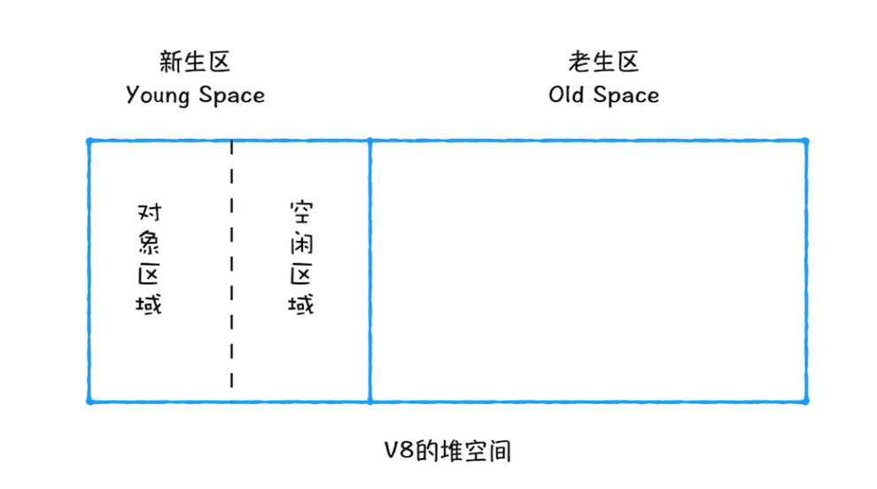
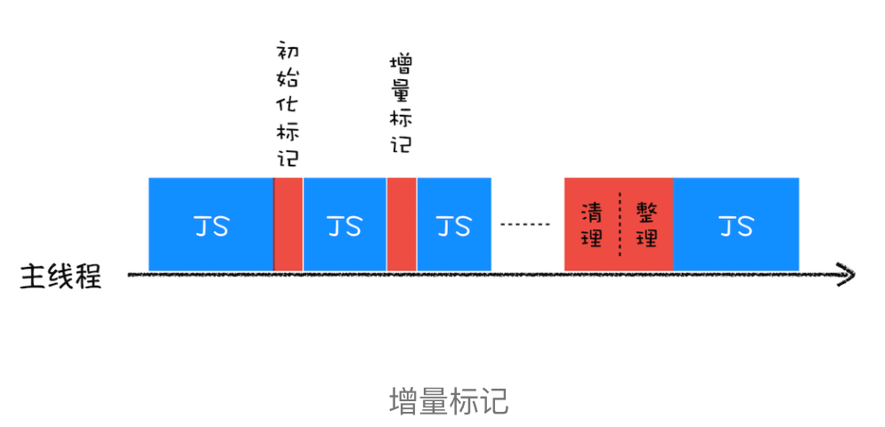
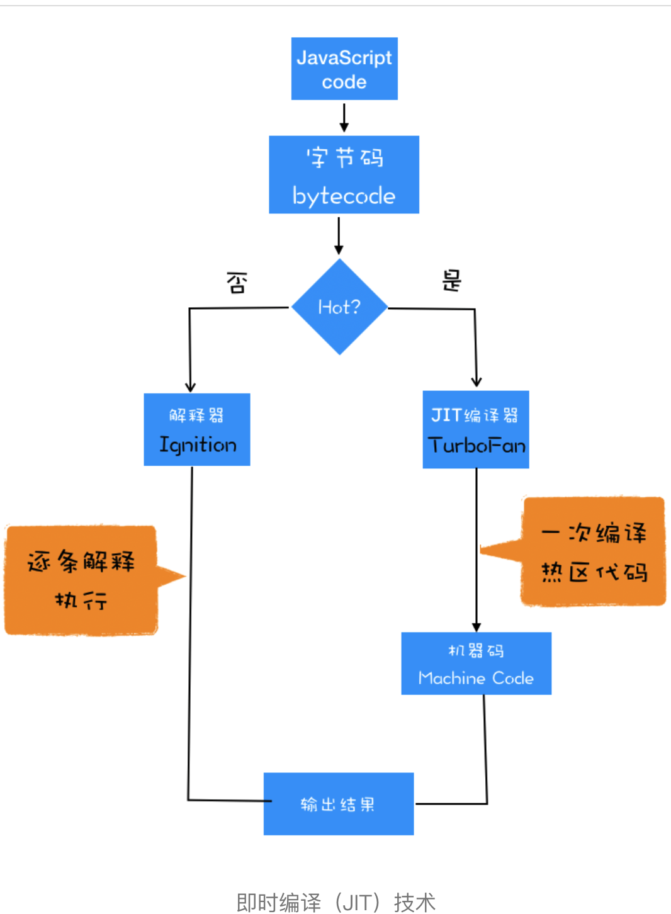
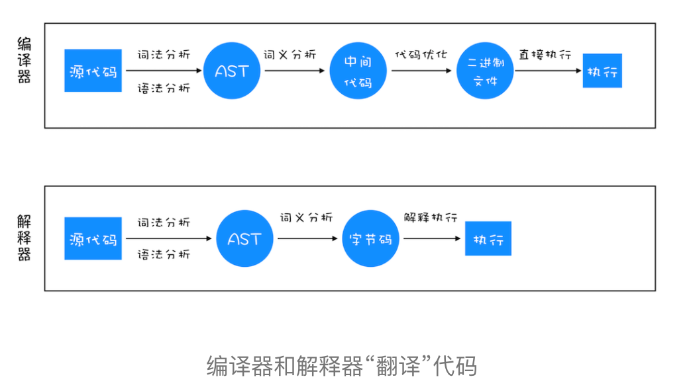

# V8

## V8垃圾回收机制
> 垃圾回有自动回收和手动回收，v8将垃圾数据分为新生区和老生区，采取不同的回收算法

js基本类型的数据是储存在栈空间，引用类型数据储存在堆空间中。当数据使用后，不再使用，就形成垃圾数据。那么Javascript如何清理垃圾数据？

**垃圾回收策略**
- 手动回收， 如C/C++
- 自动回收策略， 如javascript, python, Java

```js
function foo() {
    var a = 1;
    var b = {a: 134}

    function bar() {
        b = {c: 2}
    }
    bar()
}
foo()
```

> 理论基础： 代际假说（The Generational Hypothesis）和分代收集

- 1. 大部分对象在内存中存在的时间非常短，一经分配，很快无法访问
- 2. 不死的对象，会活得更久

---- 

### V8如何回收垃圾

V8采用分区回收机制，将堆分为新生代和老生代两个区，新生代存放生存时间短的对象，老生代存放年纪大的对象。新生区通常只有1~8M的内存容量，老生区占用容量空间就很大。
V8分别有两个垃圾回收器处理这些垃圾数据。可以看出垃圾分类回收应用到生活的每一处。两个垃圾回收器分别是： 主垃圾回收器和副垃圾回收器。

#### 垃圾回收流程：

Step1: sign标记空间中的活动对象和非活动对象 -> 
Step2: recycle回收非活动对象             ->
Step3: 内存整理，处理内存碎片


#### 副垃圾回收器
  
新生区的垃圾回收采用Scavege算法，将新生区分为两块，对象区域和空闲区域。首先对象先写入对象区域，随时时间推移，对象区域很快就被写满，这个时候需要做两个事情：
1. 做一次垃圾回收
2. 对象晋升->老生区

首先是垃圾回收，处理非活动的对象，利用新生区中的空闲去，将对象移动空闲区，腾笼换鸟，完成碎片整理。对于人老心不老的活跃分子，那就老年活动区的老生代活动。


#### 主垃圾回收器
老生区的垃圾来源出生新生代晋升的对象，还有一些较大的对象会直接分配到老生区。老生区采用**标记-清除（Mark-Sweep）**的算法进行垃圾回收，采用**标记-整理（Mark-Compact）**进行内存整理。使用scanvege算法第一耗时长，并且浪费了一半内存空间。
> 如何标记？
遍历整个调用栈，看堆内存地址存放堆变量是否被调用栈引用，被引用堆标记为活动对象，没有引用那就是垃圾数据。 
> 内存数据如何整理？ 
让所有活动对象都向内存一段移动，然后清理掉边界意外堆内存


#### V8标记清理策略 - 增量标记算法（Incremental Marking）

  

每次标记都是一次增量标记，这个整个标记实际就被分区，这样就可以分次处理，从而让Javascript应用和垃圾回收标记交替执行，减少页面停顿现象。


----
## V8执行js代码对过程

js代码通过词法分析和语法分析转换成AST语法树, 通过解释器将AST解释成字节码，V8引擎还通过编译器来优化编译成字节码。

  

> 解释型语言和非解释型语言
高级语言是无法被机器所识别对，最终机器所执行对代码都是二进制文件。
- 编译型语言： 程序执行前，通过编译器生成二进制文件，程序直接运行二进制文件。像C/C++, GO
- 解释型语言： 每次运行时都要通过解释器进行动态解析和执行，像python, JavaScript

  


### js代码到AST
- 1.词法分析，分词（tokenize）,将代码拆分成语法上最小字符单元（keyword, assignment literal, identifier）
- 2.语法分析，解析（parse）将token根据语法转换规则生成AST

### AST到字节码
首先机器码到执行效率是非常高效的，但是存在内存占用问题。字节码就是介于 AST 和机器码之间的一种代码。但是与特定类型的机器码无关，字节码需要通过解释器将其转换为机器码后才能执行。
V8的解释器Ignition的作用： 1. 生成字节码 2. 解释执行字节码

### JIT即时编译
字节码配合编译器的技术。V8中的Ignition解释器在解释和执行字节码的过程公，一旦发现HotSpot(热点代码)，是使用编译器TurboFan，将热点代码转换成机器码并保存下来，以备下次使用。
