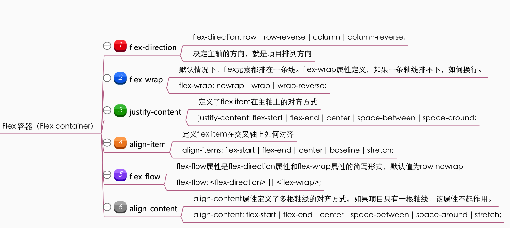
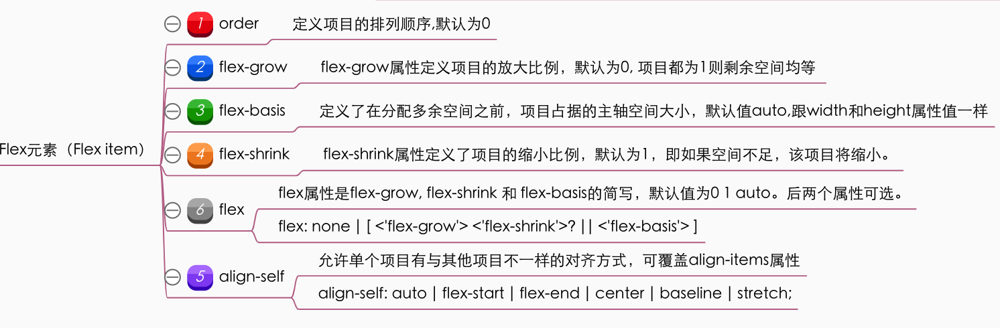

# flex布局

- flex布局概念
- flex布局的容器和轴
- flex布局用例

## flex布局概念

css布局是解决元素在页面中的空间分布和对齐问题。Flex是Flexible Box 的缩写意为"弹性布局"，用来为盒状模型提供最大的灵活性。

flex布局是一种一维的布局，一次只能处理一个维度上的元素布局，比如一次控制“行”方向或者“列方向”。所以你有可能需要使用flex-direction来修改这个方向。
作为对比的是另外一个二维布局（css grid layout），可以同时处理行和列上的布局。


## flex的轴和容器
坐标轴可以帮助我们描述一个几何图形所在的位置和大小。flex布局也有两根轴线，类似于直角坐标系，有*主轴 main axis*和*交叉轴cross axis*，但是这个轴系应该在弹性盒子的内部去理解它，它的起始和结束都在都在盒子内部。主轴的开始位置（与边框的交叉点）叫做main start，结束位置叫做main end；交叉轴的开始位置叫做cross start，结束位置叫做cross end。
  

----------


### flex容器
 

### flex元素
  


### flex布局示例 [codepen示例](https://codepen.io/AlanWen2016/pen/RwPYKPJ)
<div class="container">
  <span class="item">1</span>
</div>
<style>
    .container {
        display: flex;
        /* justify-content: center;
        align-items: center; */
        margin: 16px;
        padding: 4px;
        background-color: #e7e7e7;
        width: 104px;
        height: 104px;
    }
    .item {
        display: block;
        width: 24px;
        height: 24px;
        margin: 4px;
        background-color: #eecc00;
        color: #000;
        text-align:center;
        line-height:24px;
    }
    </style>


```
<div class="container">
  <span class="item">1</span>
</div>
<style>
    .container {
        display: flex;
        /* justify-content: center;
        align-items: center; */
        margin: 16px;
        padding: 4px;
        background-color: #e7e7e7;
        width: 104px;
        height: 104px;
    }
    .item {
        display: block;
        width: 24px;
        height: 24px;
        margin: 4px;
        background-color: #eecc00;
        color: #000;
        text-align:center;
        line-height:24px;
    }
    </style>
```


##### 1.水平垂直居中

<div class="container container1">
  <span class="item item1">1</span>
</div>
<style>
    .container1 {
        display: flex;
        justify-content: center;
        align-items: center;
        margin: 16px;
        padding: 4px;
        background-color: #e7e7e7;
        width: 104px;
        height: 104px;
    }

</style>

```css
.container1 {
    display: flex;
    justify-content: center;
    align-items: center;
    margin: 16px;
    padding: 4px;
    background-color: #e7e7e7;
    width: 104px;
    height: 104px;
}
```

##### 2.绝对底部
```
<div class="cards">
    <div class="card">
        <div class="content">
            <p>This card doesn't have much content.</p>
        </div>
        <footer>Card footer</footer>
    </div>
    <div class="card">
        <div class="content">
            <p>This card has a lot more content which means that it defines the height of the container the cards are in. I've laid the cards out using grid layout, so the cards themselves will stretch to the same height.</p>
        </div>
        <footer>Card footer</footer>
    </div>
</div>
<style>
.card {
    display: flex;
    flex-direction: column;
}

.card .content {
    flex: 1 1 auto;
}
</style>
```
<div class="cards">
    <div class="card">
        <div class="content">
            <p>This card doesn't have much content.</p>
        </div>
        <footer class="footer">Card footer</footer>
    </div>
    <div class="card">
        <div class="content">
            <p>This card has a lot more content which means that it defines the height of the container the cards are in. I've laid the cards out using grid layout, so the cards themselves will stretch to the same height.</p>
        </div>
        <footer class="footer">Card footer</footer>
    </div>
</div>
<style>
.cards{
    width: 500px;
    height: 300px;
}
.card {
    margin: 20px;
    border: 1px solid red;
    display: flex;
    flex-direction: column;
}
.card .content {
    flex: 1 1 auto;
}
.footer{
    background-color: #e7e7e7;
}
</style>


##### 如何实现骰子布局?
<div class="layout-demo2">
<div class="first-face">
  <span class="pip"></span>
</div>
<div class="second-face">
  <span class="pip"></span>
  <span class="pip"></span>
</div>
<div class="third-face">
  <span class="pip"></span>
  <span class="pip"></span>
  <span class="pip"></span>
</div>
<div class="fourth-face">
  <div class="column">
    <span class="pip"></span>
    <span class="pip"></span>
  </div>
  <div class="column">
    <span class="pip"></span>
    <span class="pip"></span>
  </div>
</div>
<div class="fifth-face">
  <div class="column">
    <span class="pip"></span>
    <span class="pip"></span>
  </div>
  <div class="column">
    <span class="pip"></span>
  </div>
  <div class="column">
    <span class="pip"></span>
    <span class="pip"></span>
  </div>
</div>
<div class="sixth-face">
  <div class="column">
    <span class="pip"></span>
    <span class="pip"></span>
    <span class="pip"></span>
  </div>
  <div class="column">
    <span class="pip"></span>
    <span class="pip"></span>
    <span class="pip"></span>
  </div>
</div>

</div>


<style>
.layout-demo2{
    display: flex;
    flex-wrap: wrap;
}
.first-face {
  display: flex;
  justify-content: center;
  align-items: center;
}

.second-face {
  display: flex;
  justify-content: space-between;
}

.second-face .pip:nth-of-type(2) {
  align-self: flex-end;
}

.third-face {
  display: flex;
  justify-content: space-between;
}
  
.third-face .pip:nth-of-type(2) {
  align-self: center;
}

.third-face .pip:nth-of-type(3) {
  align-self: flex-end;
}

.fourth-face, .sixth-face {
  display: flex;
  justify-content: space-between;
}

.fourth-face .column, .sixth-face .column {
  display: flex;
  flex-direction: column;
  justify-content: space-between;
}

.fifth-face {
  display: flex;
  justify-content: space-between;
}
  
.fifth-face .column {
  display: flex;
  flex-direction: column;
  justify-content: space-between;
}
  
.fifth-face .column:nth-of-type(2) {
  justify-content: center;
}
[class$="face"] {
  margin: 16px;
  padding: 4px;
  
  background-color: #e7e7e7;
  width: 104px;
  height: 104px;
  object-fit: contain;
  
  box-shadow:
    inset 0 5px white, 
    inset 0 -5px #bbb,
    inset 5px 0 #d7d7d7, 
    inset -5px 0 #d7d7d7;
  
  border-radius: 10%;
}

.pip {
  display: block;
  width: 24px;
  height: 24px;
  border-radius: 50%;
  margin: 4px;

  background-color: #333;
  box-shadow: inset 0 3px #111, inset 0 -3px #555;
}
    </style>


_____

参考资料：
1. [flex 布局的基本概念](https://developer.mozilla.org/zh-CN/docs/Web/CSS/CSS_Flexible_Box_Layout/Basic_Concepts_of_Flexbox)
2. []()