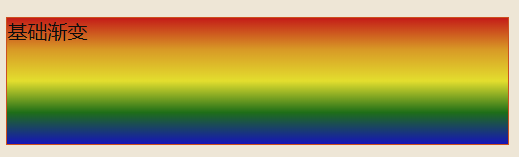
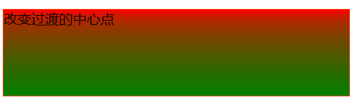
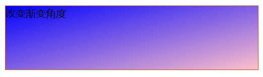
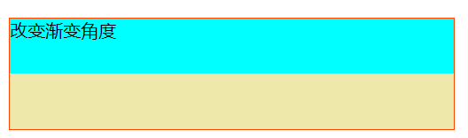
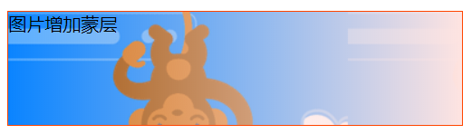
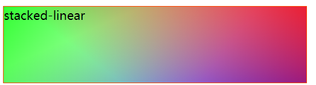

### CSS渐变

CSS渐变实现两种或者多种颜色渐进过渡，有三种类型渐变

- a. 线性渐变，由line-gradient 函数创建
- b. 径向渐变，由 radial-gradient 函数创建
- c. 圆锥圆锥，由 conic-gradient 函数创建


::: tip 
基本线性线性渐变
:::

  使用多个颜色值（颜色+百分比）
```js
.simple-linear {
   background:  linear-gradient(red, orange, yellow, green, blue);
}
```

 
::: tip 
改变颜色过渡的中心点
:::

两个颜色之间使用百分数： background: linear-gradient(red, 30%, green)



> 改变渐变角度 


使用 to bottom, right, left top的组合或者角度（deg）： 

```js{4}
.diagonal-gradient {
    background: linear-gradient(to bottom right, blue, pink);
}
```


 
::: tip 
创建实线
:::


使用 to bottom, right, left top的组合或者角度（deg）： 
```js
.striped {
    background: linear-gradient(to bottom, cyan 50%, palegoldenrod 50%);
}
```


 
::: tip 
图片增加蒙层
:::

```js
.layered-image {
    background: linear-gradient(to right, transparent, mistyrose),
        url("https://mdn.mozillademos.org/files/15525/critters.png");
}
```


 

::: tip 
多层堆叠
:::
```js
.stacked-linear {
    background:
        linear-gradient(217deg, rgba(255, 0, 0, .8), rgba(255, 0, 0, 0) 70.71%),
        linear-gradient(127deg, rgba(0, 255, 0, .8), rgba(0, 255, 0, 0) 70.71%),
        linear-gradient(336deg, rgba(0, 0, 255, .8), rgba(0, 0, 255, 0) 70.71%);
}
```



