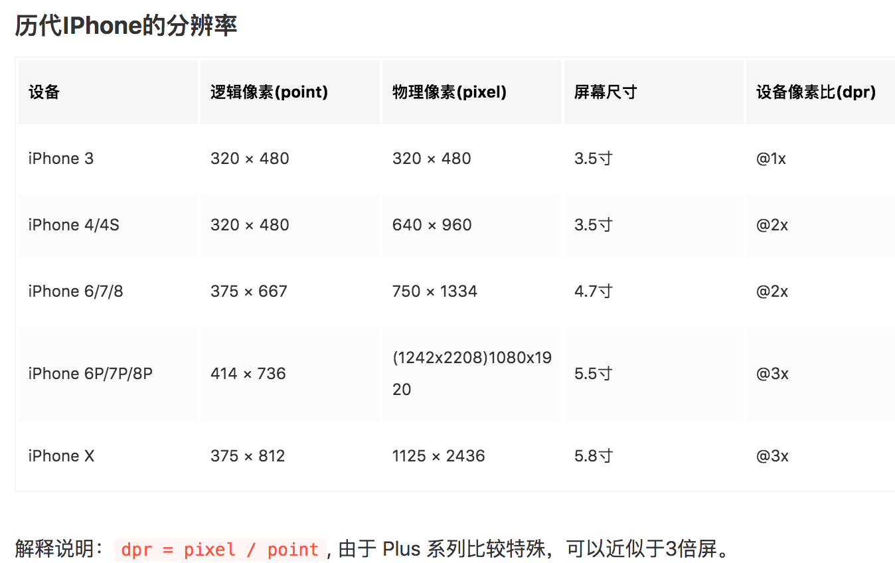
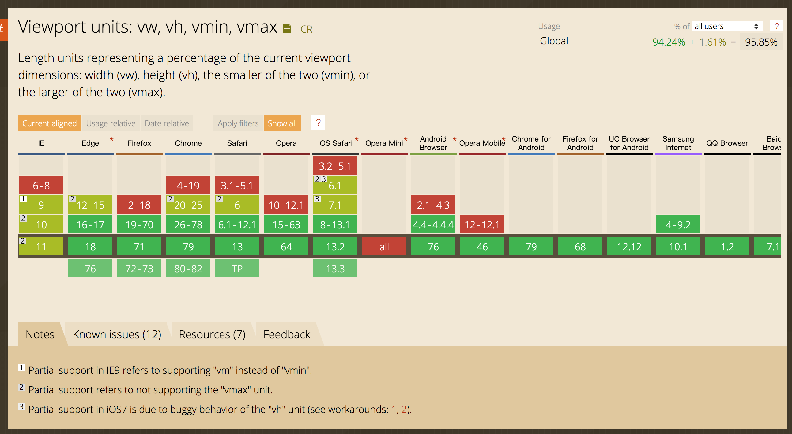
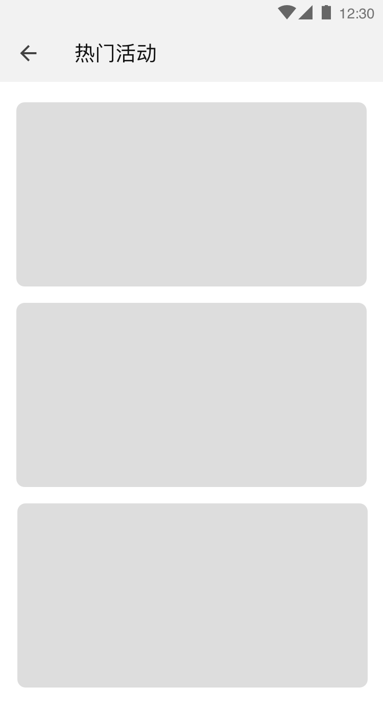
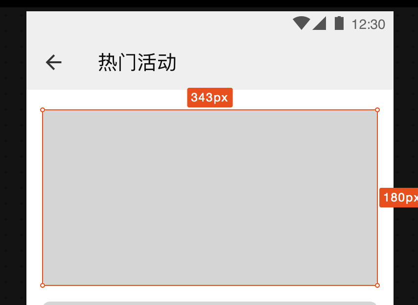

# 移动端页面的适配问题

> 移动端页面适配解决方案、不同机型适配方案

- media query
- REM
- vw/vm
- 1px boder解决方法


> 物理像素（physical pixel）
物理像素又被称为设备像素，他是显示设备中一个最微小的物理部件，retina设备像素为独立像素的2倍, 例如 iphone 6/7/8 系列

> 设备独立像素（density-independent pixel）
设备独立像素也称为密度无关像素，又称为逻辑像素，一个点代表一个可以由程序使用的虚拟像素（PX）。

> 设备像素比dpr(devicePixelRatio) ＝ 物理像素 / 设备独立像素

iphone使用的设备物理像素一般都比设备逻辑像素大，设备像素比就是这个比例的衡量，为了保证设计稿的显示效果，都会为设计稿设计多倍像素，以满足在高分辨率屏幕上的显示。



## REM方案

在W3C官网上是这样描述rem的——“font size of the root element”，就是html元素的font-size，其余元素是尺寸使用rem,通过动态修改rem的尺寸，修改页面尺寸。
修改rem方式有两种
1. 通过js计算,
```
const oHtml = document.getElementsByTagName('html')[0]
const width = oHtml.clientWidth;
// 320px的屏幕基准像素为12px
oHtml.style.fontSize = 12 * (width / 320) + "px";
```
rem方案的缺陷也是明显的，例如文字可能不适合按照rem比例缩放。可以阅读参考 [rem不是神农草，治不了移动端百病](https://imweb.io/topic/5745adf5a94f742c1db63485)

2. 通过媒体查询 
```css
@media screen and (min-width: 375px){
    html {
        font-size: 14.0625px;   
    }
}
@media screen and (min-width: 360px){
    html {
        font-size: 13.5px;
    }
}
@media screen and (min-width: 320px){
    html {
        font-size: 12px;
    }
}
html {
    font-size: 16px;
}
```


Flexible源码分析
```js
;(function(win, lib) {
    var doc = win.document;
    var docEl = doc.documentElement;
    var metaEl = doc.querySelector('meta[name="viewport"]');
    var flexibleEl = doc.querySelector('meta[name="flexible"]');
    var dpr = 0;
    var scale = 0;
    var tid;
    var flexible = lib.flexible || (lib.flexible = {});
    
    if (metaEl) { // 设置viewport的meta标签存在，将这个设置缩放比例当作默认值
        console.warn('将根据已有的meta标签来设置缩放比例');
        var match = metaEl.getAttribute('content').match(/initial\-scale=([\d\.]+)/);
        if (match) {
            scale = parseFloat(match[1]);
            dpr = parseInt(1 / scale);
        }
         var content = flexibleEl.getAttribute('content');
        if (content) {
            var initialDpr = content.match(/initial\-dpr=([\d\.]+)/);
            var maximumDpr = content.match(/maximum\-dpr=([\d\.]+)/);
            if (initialDpr) {
                dpr = parseFloat(initialDpr[1]);
                scale = parseFloat((1 / dpr).toFixed(2));    
            }
            if (maximumDpr) {
                dpr = parseFloat(maximumDpr[1]);
                scale = parseFloat((1 / dpr).toFixed(2));    
            }
        }
    }

    if (!dpr && !scale) { // 用户没有手动设置dpr和viewport缩放比例
        var isAndroid = win.navigator.appVersion.match(/android/gi);
        var isIPhone = win.navigator.appVersion.match(/iphone/gi);
        var devicePixelRatio = win.devicePixelRatio;
        if (isIPhone) {
            // iOS下，对于2和3的屏，用2倍的方案，其余的用1倍方案
            if (devicePixelRatio >= 3 && (!dpr || dpr >= 3)) {                
                dpr = 3;
            } else if (devicePixelRatio >= 2 && (!dpr || dpr >= 2)){
                dpr = 2;
            } else {
                dpr = 1;
            }
        } else {
            // 其他设备下，仍旧使用1倍的方案
            dpr = 1;
        }
        scale = 1 / dpr;
    }
    // 给html元素设置了一个 data-dpr属性
    docEl.setAttribute('data-dpr', dpr);
    if (!metaEl) {
        metaEl = doc.createElement('meta');
        metaEl.setAttribute('name', 'viewport');
        metaEl.setAttribute('content', 'initial-scale=' + scale + ', maximum-scale=' + scale + ', minimum-scale=' + scale + ', user-scalable=no');
        if (docEl.firstElementChild) { // head标签
            docEl.firstElementChild.appendChild(metaEl);
        } else { // 为什么用要div来包裹meta???
            var wrap = doc.createElement('div');
            wrap.appendChild(metaEl);
            doc.write(wrap.innerHTML);
        }
    }

    function refreshRem(){ // 计算rem尺寸 540 = 1080/2 ????
        var width = docEl.getBoundingClientRect().width;
        if (width / dpr > 540) {
            width = 540 * dpr;
        }
        var rem = width / 10;
        docEl.style.fontSize = rem + 'px';
        flexible.rem = win.rem = rem;
    }
    // 视窗缩放，重新配置rem
    win.addEventListener('resize', function() {
        clearTimeout(tid);
        tid = setTimeout(refreshRem, 300);
    }, false);
    // pageshow ?? 什么事件
    win.addEventListener('pageshow', function(e) {
        if (e.persisted) {
            clearTimeout(tid);
            tid = setTimeout(refreshRem, 300);
        }
    }, false);

    if (doc.readyState === 'complete') {
        doc.body.style.fontSize = 12 * dpr + 'px';
    } else {
        doc.addEventListener('DOMContentLoaded', function(e) {
            doc.body.style.fontSize = 12 * dpr + 'px';
        }, false);
    }
    

    refreshRem();

    flexible.dpr = win.dpr = dpr;
    flexible.refreshRem = refreshRem;
    flexible.rem2px = function(d) {
        var val = parseFloat(d) * this.rem;
        if (typeof d === 'string' && d.match(/rem$/)) {
            val += 'px';
        }
        return val;
    }
    flexible.px2rem = function(d) {
        var val = parseFloat(d) / this.rem;
        if (typeof d === 'string' && d.match(/px$/)) {
            val += 'rem';
        }
        return val;
    }

})(window, window['lib'] || (window['lib'] = {}));
```

2.0版本
```js
(function flexible (window, document) {
  var docEl = document.documentElement
  var dpr = window.devicePixelRatio || 1

  // adjust body font size
  function setBodyFontSize () {
    if (document.body) {
      document.body.style.fontSize = (12 * dpr) + 'px'
    }
    else {
      document.addEventListener('DOMContentLoaded', setBodyFontSize)
    }
  }
  setBodyFontSize();

  // set 1rem = viewWidth / 10
  function setRemUnit () {
    var rem = docEl.clientWidth / 10
    docEl.style.fontSize = rem + 'px'
  }

  setRemUnit()

  // reset rem unit on page resize
  window.addEventListener('resize', setRemUnit)
  window.addEventListener('pageshow', function (e) {
    if (e.persisted) {
      setRemUnit()
    }
  })

  // detect 0.5px supports
  if (dpr >= 2) {
    var fakeBody = document.createElement('body')
    var testElement = document.createElement('div')
    testElement.style.border = '.5px solid transparent'
    fakeBody.appendChild(testElement)
    docEl.appendChild(fakeBody)
    if (testElement.offsetHeight === 1) {
      docEl.classList.add('hairlines')
    }
    docEl.removeChild(fakeBody)
  }
}(window, document))
```


------
### px转rem方法

1. 使用 sass函数
```scss
@function px2em($px, $base-font-size: 16px) {
    @if (unitless($px)) {
        @warn "Assuming #{$px} to be in pixels, attempting to convert it into pixels for you";
        @return px2em($px + 0px); // That may fail.
    } @else if (unit($px) == em) {
        @return $px;
    }
    @return ($px / $base-font-size) * 1em;
}
```
2. npm sass-rem
https://github.com/pierreburel/sass-rem

------
## vw/vh方案

css3新增的vw、vh、vmin、vmax 是一种视窗单位，由视窗（Viewport）大小来决定的，单位 1，代表类似于 1%。
- vw：视窗宽度的百分比（1vw 代表视窗的宽度为 1%）
- vh：视窗高度的百分比
- vmin：当前 vw 和 vh 中较小的一个值
- vmax：当前 vw 和 vh 中较大的一个值

> vmin、vmax的用途
做移动页面开发时，如果使用 vw、wh 设置字体大小（比如 5vw），在竖屏和横屏状态下显示的字体大小是不一样的。   
由于 vmin 和 vmax 是当前较小的 vw 和 vh 和当前较大的 vw 和 vh。这里就可以用到 vmin 和 vmax。使得文字大小在横竖屏下保持一致。


### [vw/vh兼容性](https://www.caniuse.com/#search=vw)

- 桌面 PC
Chrome：自 26 版起就完美支持（2013年2月）
Firefox：自 19 版起就完美支持（2013年1月）
Safari：自 6.1 版起就完美支持（2013年10月）
Opera：自 15 版起就完美支持（2013年7月）
IE：自 IE10 起（包括 Edge）到现在还只是部分支持（不支持 vmax，同时 vm 代替 vmin）
 
- 移动设备
Android：自 4.4 版起就完美支持（2013年12月）
iOS：自 iOS8 版起就完美支持（2014年9月）

### vw项目使用
[如何在Vue项目中使用vw实现移动端适配](https://www.w3cplus.com/mobile/vw-layout-in-vue.html)
按照文章，写了一个dome, 放到github[demo传送门](https://github.com/AlanWen2016/vw-layout.git)上面，主要解决问题：
1. 自动将px转为为vw
2. 解决1px问题，就是解决响应式页面中不需要用响应式的元素

## 1px border问题

### 1px border解决方案： 伪类 + transform

<style>
  /*手机端实现真正的一像素边框*/
  .border-1px, .border-bottom-1px, .border-top-1px, .border-left-1px, .border-right-1px {
    position: relative;
  }
  /*线条颜色 黑色*/
  .border-1px::after, .border-bottom-1px::after, .border-top-1px::after, .border-left-1px::after, .border-right-1px::after {
    /*background-color: #000;*/
  }
  /*底边边框一像素*/
  .border-bottom-1px::after {
    content: "";
    position: absolute;
    left: 0;
    bottom: 0;
    width: 100%;
    height: 1px;
    transform-origin: 0 0;
  }

  /*上边边框一像素*/
  .border-top-1px::after {
    content: "";
    position: absolute;
    left: 0;
    top: 0;
    width: 100%;
    height: 1px;
    transform-origin: 0 0;
  }

  /*左边边框一像素*/
  .border-left-1px::after {
    content: "";
    position: absolute;
    left: 0;
    top: 0;
    width: 1px;
    height: 100%;
    transform-origin: 0 0;
  }

  /*右边边框1像素*/
  .border-right-1px::after {
    content: "";
    box-sizing: border-box;
    position: absolute;
    right: 0;
    top: 0;
    width: 1px;
    height: 100%;
    transform-origin: 0 0;
  }

  /*边框一像素*/
  .border-1px::after {
    content: "";
    box-sizing: border-box;
    position: absolute;
    left: 0;
    top: 0;
    width: 100%;
    height: 100%;
    border: 1px solid red;
    border-radius: 10px;
    /*background-color: #42b983;*/
  }
  /*设备像素比*/
  /*显示屏最小dpr为2*/
  @media (-webkit-min-device-pixel-ratio: 2) {
    .border-bottom-1px::after, .border-top-1px::after {
      transform: scaleY(0.5);
    }

    .border-left-1px::after, .border-right-1px::after {
      transform: scaleX(0.5);
    }

    .border-1px::after {
      width: 200%;
      height: 200%;
      transform: scale(0.5);
      transform-origin: 0 0;
    }
  }

  /*设备像素比*/
  @media (-webkit-min-device-pixel-ratio: 3)  {
    .border-bottom-1px::after, .border-top-1px::after {
      transform: scaleY(0.333);
    }

    .border-left-1px::after, .border-right-1px::after {
      transform: scaleX(0.333);
    }

    .border-1px::after {
      width: 300%;
      height: 300%;
      transform: scale(0.333);
      transform-origin: 0 0;
    }
  }
  /*需要注意<input type="button">是没有:before, :after伪元素的*/
</style>


2. postcss-write-svg实现
以vue项目为例子：安装和配置postcss-write-svg
```
npm install postcss-write-svg
```
```js
// vue.config.js
module.exports = {
  css: {
    loaderOptions: {
      css: {},
      postcss: {
        plugins: [
          require('postcss-write-svg')({
            utf8: false
          }),
          require('postcss-px2rem')({
            remUnit: 37.5
          })
        ]
      }
    }
  }
}
```
定义svg函数，下面是一个示例
```html
<style scoped lang="scss">
  @svg 1px-border {
    width: 4px;
    height: 4px;
    @rect {
      fill: transparent;  // content为透明
      width: 100%;  // 宽度为4px * 100%
      height: 100%;  // 高度为4px * 100%
      stroke-width: 25%;  // 边框宽度 4px * 25%(即1px)
      stroke: var(--color, black);  // 颜色
    }
  }
  .child2{
    color: red;
    display: inline-block;
    width: 100px;
    height: 100px;/*no*/
    /*border: .5px solid red;*/
    border: 1px solid;
    border-image: svg(1px-border param(--color #ffcc00)) 1 stretch;
    /*border-radius: 20px;*/ // 设置无效
  }
```

### 移动端适配的那些事
使用@vue/cli4.0搭建了一个vue架子：放到github[demo传送门](https://github.com/AlanWen2016/vue-flexible-template.git)上面。  

一般设计稿的尺寸都是以iphone6为基准，iphone6的设备像素（物理像素） 375px*1334px。下图是设计师同学给到设计稿件。

实际页面尺寸是343px * 180px, 实际切图尺寸是2倍像素,即 686px * 360px; 问题就归结到如何适配这个页面。



参考资料：

1. [再聊移动端页面的适配](https://blog.csdn.net/qq_21729177/article/details/79466951)  
2. [如何在Vue项目中使用vw实现移动端适配(转)](https://www.jianshu.com/p/1f1b23f8348f)  
3. [viewports剖析](https://www.w3cplus.com/css/viewports.html)   
4. [简单粗暴的移动端适配方案 - REM](https://imweb.io/topic/5a523cc0a192c3b460fce3a5)   
5. [使用Flexible实现手淘H5页面的终端适配](https://github.com/amfe/article/issues/17)  
6. [rem不是神农草，治不了移动端百病](https://imweb.io/topic/5745adf5a94f742c1db63485)
7. [在移动浏览器中使用viewport元标签控制布局](https://developer.mozilla.org/zh-CN/docs/Mobile/Viewport_meta_tag)