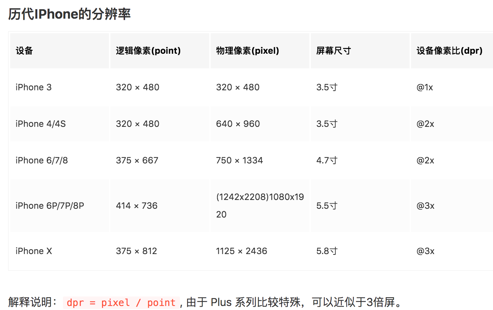

# 移动端页面的适配问题

> 移动端页面适配解决方案、不同机型适配方案

## 

> 物理像素（physical pixel）
物理像素又被称为设备像素，他是显示设备中一个最微小的物理部件，retina设备像素为独立像素的2倍, 例如 iphone 6/7/8 系列

> 设备独立像素（density-independent pixel）
设备独立像素也称为密度无关像素，又称为逻辑像素，一个点代表一个可以由程序使用的虚拟像素（PX）。

> 设备像素比(devicePixelRatio) ＝ 物理像素 / 设备独立像素

iphone使用的设备物理像素一般都比设备逻辑像素大，设备像素比就是这个比例的衡量，为了保证设计稿的显示效果，都会为设计稿设计多倍像素，以满足在高分辨率屏幕上的显示。

## Flexible方案

## 

参考资料：

[再聊移动端页面的适配](https://blog.csdn.net/qq_21729177/article/details/79466951)

[如何在Vue项目中使用vw实现移动端适配(转)](https://www.jianshu.com/p/1f1b23f8348f)