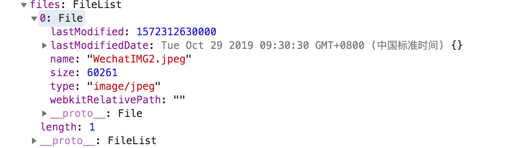
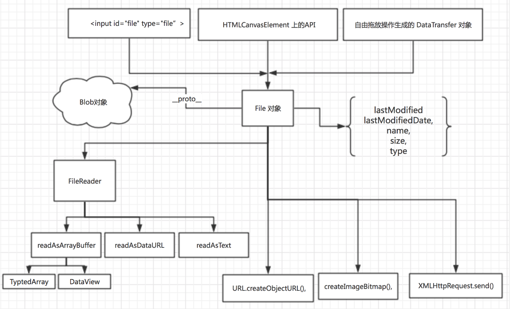

# 文件上传与二进制数组

先思考几个问题：
1. 如何上传一张图片，并且预览？
2. 前端上传图片如何压缩？


## 文件上传 input
先看一个文件上传，前端压缩的例子,复习一下基础知识
```html
  <div id="uploader">
        <input id="file" type="file">
    </div>
    <script>
        var eleFile = document.querySelector('#file');
        eleFile.addEventListener('change', function (event) {
            file = event.target.files[0];
            console.log(event)
        // 选择的文件是图片
        });
    </script>
```

点击上传一张图片，通过打印输出我们得到文件相关信息。

  
给input标签绑定change事件，并获取上传的文件对象，前端对文件的操作就是操作这个文件对象。


```js
var eleFile = document.querySelector('#file');
// 压缩图片需要的一些元素和对象
var reader = new FileReader(), img = new Image();

// 选择的文件对象
var file = null;

// 缩放图片需要的canvas
var canvas = document.createElement('canvas');
var context = canvas.getContext('2d');

// base64地址图片加载完毕后
img.onload = function () {
    // 图片原始尺寸
    var originWidth = this.width;
    var originHeight = this.height;
    // 最大尺寸限制
    var maxWidth = 400, maxHeight = 400;
    // 目标尺寸
    var targetWidth = originWidth, targetHeight = originHeight;
    // 图片尺寸超过400x400的限制
    if (originWidth > maxWidth || originHeight > maxHeight) {
        if (originWidth / originHeight > maxWidth / maxHeight) {
            // 更宽，按照宽度限定尺寸
            targetWidth = maxWidth;
            targetHeight = Math.round(maxWidth * (originHeight / originWidth));
        } else {
            targetHeight = maxHeight;
            targetWidth = Math.round(maxHeight * (originWidth / originHeight));
        }
    }
        
    // canvas对图片进行缩放
    canvas.width = targetWidth;
    canvas.height = targetHeight;
    // 清除画布
    context.clearRect(0, 0, targetWidth, targetHeight);
    // 图片压缩
    context.drawImage(img, 0, 0, targetWidth, targetHeight);
    // canvas转为blob并上传
    canvas.toBlob(function (blob) {
        // 图片ajax上传
        var xhr = new XMLHttpRequest();
        // 文件上传成功
        xhr.onreadystatechange = function() {
            if (xhr.status == 200) {
                // xhr.responseText就是返回的数据
            }
        };
        // 开始上传
        xhr.open("POST", 'upload.php', true);
        xhr.send(blob);    
    }, file.type || 'image/png');
};

// 文件base64化，以便获知图片原始尺寸
reader.onload = function(e) {
    img.src = e.target.result;
};
eleFile.addEventListener('change', function (event) {
    file = event.target.files[0];
    // 选择的文件是图片
    if (file.type.indexOf("image") == 0) {
        reader.readAsDataURL(file);    
    }
});
```


## 文件对象File与Blog对象
The File interface provides information about files and allows JavaScript in a web page to access their content.
JS通过File对象来获取文件信息。一般，File对象来源与input文件上传的fileList对象，（上图例子的event.target.files）。其他来源看[File-MDN](https://developer.mozilla.org/zh-CN/docs/Web/API/File)

### 构造函数File
> 返回一个新构建的文件对象（File）
File对象的属性方法如下，从文件对象信息里，可以获取上传的文件名称、文件大小（单位：字节）、文件类型。__proto__表示文件原型链直接文件对象File。
```js
{
    lastModified: 1572312630000
    lastModifiedDate: Tue Oct 29 2019 09:30:30 GMT+0800 (中国标准时间) {}
    name: "WechatIMG2.jpeg"
    size: 60261
    type: "image/jpeg"
    webkitRelativePath: ""
    __proto__: File
}
```

### Blob
Blob 对象表示一个不可变、原始数据的类文件对象。Blob 表示的不一定是JavaScript原生格式的数据。File 接口基于Blob，继承了 blob 的功能并将其扩展使其支持用户系统上的文件。

### Blog对象

> 构造函数Blob, 返回一个新的blob对象
var aBlob = new Blob( array, options )

- array 是一个由ArrayBuffer, ArrayBufferView, Blob, DOMString 等对象构成的 Array ，或者其他类似对象的混合体，它将会被放进 Blob。DOMStrings会被编码为UTF-8。

- option 用于指定MIME类型和控制结束符字符串\n以什么形式写入

```js
option = {
    type: 'text/html',
    endings: 'transparent' // transparent表示保留原样，native表示改为适应操作系统

}
```
使用示例
```js
// demo
var aFileParts = ['<a id="a"><b id="b">hey!</b></a>']; // 一个包含DOMString的数组
var oMyBlob = new Blob(aFileParts, {type : 'text/html'}); // 得到 blob

```

#### Blog对象包含属性方法

- type
- size
- slice()
- stream()
- text()
- arrayBuffer()


### 处理File/Blog对象的Api

FileReader, URL.createObjectURL(), createImageBitmap(), 及 XMLHttpRequest.send() 都能处理 Blob 和 File

#### FileReader

FileReader对象，提供js读取储存在用户计算机上的文件。下面是一个文件预览的示例代码，将Files对象转成dataUrl。
```js
function handleFiles(files) {
    var preview = document.querySelector('#preview');
  for (var i = 0; i < files.length; i++) {
    var file = files[i];
    var imageType = /^image\//;
    
    if (!imageType.test(file.type)) {
      continue;
    }
    
    var img = document.createElement("img");
    img.classList.add("obj");
    img.file = file;
    preview.appendChild(img); // 假设"preview"就是用来显示内容的div
    
    var reader = new FileReader();
    reader.onload = (function(aImg) {
         return function(e) { 
                aImg.src = e.target.result; 
             };
          })(img);
    reader.readAsDataURL(file); // 将文件对象读成base64用于展示
  }
}
```

> 文件上传是上传文件对象File/Blog对象，base64字符串要如何转成文件对象？
```js

```
```js
// 一个1*1像素的黑色图片
let dataUrl = "data:image/gif;base64,R0lGODlhAQABAIAAAAUEBAAAACwAAAAAAQABAAACAkQBADs="
function transformBase64ToFile(dataUrl){
    let base64Arr = dataUrl.split(',')
    // 获取mime类型
    let mime = base64Arr[0].match(/:(.*?);/)[1]
    // 转为二进制
    let bytes = window.atob(base64Arr[1].replace(/\s/g, ''))
    let n = bytes.length
    // 转成二进制数组
    let byteArray = new Uint8Array(n)
    while(n--){
        byteArray[n] = bytes.charCodeAt(n)
    }
    // btyeArray = Uint8Array(35) [71, 73, 70, 56, 57, 97, 1, 0, 1, 0, 128, 0, 0, 5, 4, 4, 0, 0, 0, 44, 0, 0, 0, 0, 1, 0, 1, 0, 0, 2, 2, 68, 1, 0, 59]
0: 71
    var file = new Blob([byteArray], {type: mime})
    file.lastModifiedDate = new Date()
    file.name = 'file-name' // 
    return file
}

// 将Blob对象转换为base64,验证一个
let file = transformBase64ToFile(dataUrl)
let preview = document.querySelector('#preview')
var img = document.createElement("img");
    img.classList.add("obj");
    img.file = file;
    preview.appendChild(img); // 假设"preview"就是用来显示内容的div
    var reader = new FileReader();
    reader.onload = (function(aImg) {
         return function(e) { 
                aImg.src = e.target.result; 
             };
          })(img);
    reader.readAsDataURL(file); // 将文件对象读成base64用于展示
```

## ArrayBuffer
ArrayBuffer对象、TypedArray视图和DataView视图是 JavaScript 操作二进制数据的一个接口。

ArrayBuffer有两种视图，一种是TypedArray视图，另一种是DataView视图。前者的数组成员都是同一个数据类型，后者的数组成员可以是不同的数据类型。

区别： 

TyptedArray视图：
- 数组成员都是同一种数据类型
- 用于网卡、声卡之类的本机设备传送数据，所以使用本机字节序

DataView视图：
- 数组成员可以是不同数据类型
- 用于网络设备传输数据，大端字节序或小端字节序

## base64 编码与解码
- btoa：从 String 对象中创建一个 base-64 编码的 ASCII 字符串，其中字符串中的每个字符都被视为一个二进制数据字节
atob() 对经过 base-64 编码的字符串进行解码
```
let encodedData = window.btoa("Hello, world"); // base64 编码 转ACII
let decodedData = window.atob(encodedData); // 解码 成 ASCII 
```
### URL.createObjectURL
```js
function handleFiles(files) {
  if (!files.length) {
    fileList.innerHTML = "<p>No files selected!</p>";
  } else {
    fileList.innerHTML = "";
    const list = document.createElement("ul");
    fileList.appendChild(list);
    for (let i = 0; i < files.length; i++) {
      const li = document.createElement("li");
      list.appendChild(li);
      
      const img = document.createElement("img");
      img.src = window.URL.createObjectURL(files[i]);
      img.height = 60;
      img.onload = function() {
        window.URL.revokeObjectURL(this.src);
      }
      li.appendChild(img);
      const info = document.createElement("span");
      info.innerHTML = files[i].name + ": " + files[i].size + " bytes";
      li.appendChild(info);
    }
  }
}
```





## 附录

### MIME TYPE
[MIME types](https://developer.mozilla.org/en-US/docs/Web/HTTP/Basics_of_HTTP/MIME_types)

总结：
MIME TYPE一个用来标识文件、字节流、文档性质和格式的标准。浏览器通常使用MIME类型（而不是文件扩展名）来确定如何处理URL，因此Web服务器在响应头中添加正确的MIME类型非常重要。
常见的mime type有：
::: tip 
text/plain  
text/html  
image/jpeg  
image/png  
audio/mpeg  
audio/ogg  
audio/*  
video/mp4  
application/*
application/json  
application/javascript  
application/ecmascript  
application/octet-stream  
application/pdf  
:::

-------------

参考： 

1. [HTML5 file API加canvas实现图片前端JS压缩并上传](https://www.zhangxinxu.com/wordpress/2017/07/html5-canvas-image-compress-upload/)  
2. [在web应用程序中使用文件](https://developer.mozilla.org/zh-CN/docs/Web/API/File/Using_files_from_web_applications)  
3. [二进制数组-阮一峰](https://es6.ruanyifeng.com/?search=charcodeat&x=0&y=0#docs/arraybuffer)