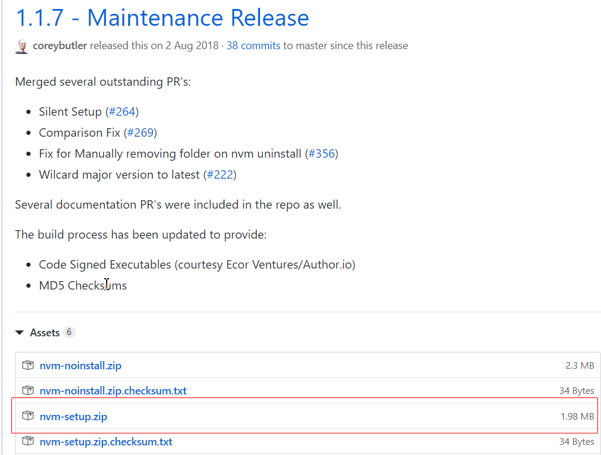
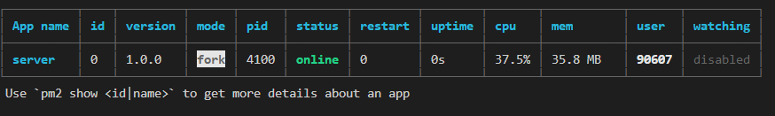
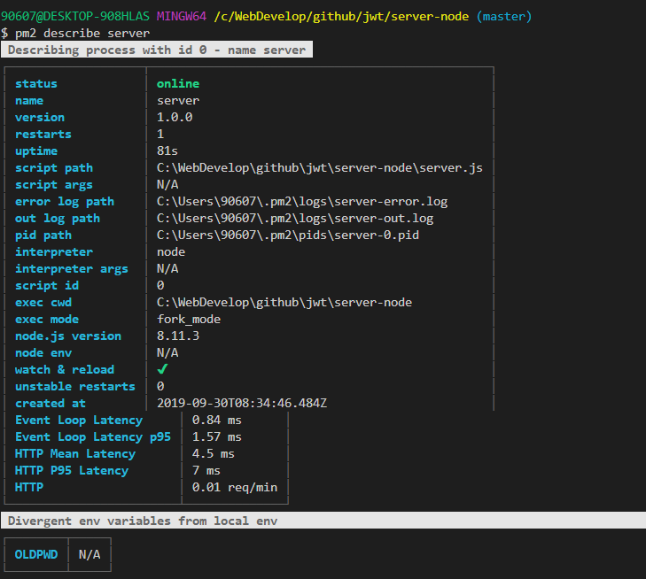

# Node


## Node版本切换工具 nvm
### windows下安装
```
// 下载源
https://github.com/coreybutler/nvm-windows/releases

// 下载可执行文件
nvm-setup.zip
```


### 使用方法

- 下载Node版本
```
nvm install <version>[arch]
nvm install 8.11.3 64 // 版本 操作系统位数
```
- 选择使用Node版本
```
nvm use 8.11.64
```
- 查看当前可用版本
```
nvm list
```
## Node安装源切换工具 nrm
```bash
// 全局安装
npm install -g nrm

// 查看可用源
nrm ls
// 切换安装源
nrm use taobao
// 切回官方源
nrm use npm
// 查看npm配置信息
npm config list
```


## Node进程管理工具 PM2

### 安装
```bash
npm install pm2 -g
```
###  启动服务
```bash
// 启动文件
pm2 start server.js
pm2 start server.js --name serverName
// 启动脚本
pm2 start app.sh  
```

### 停用、删除服务
```
pm2 stop all               //停止所有应用
pm2 stop [AppName]        //根据应用名停止指定应用
pm2 stop [ID]             //根据应用id停止指定应用

pm2 delete all               //关闭并删除应用
pm2 delete [AppName]        //根据应用名关闭并删除应用
pm2 delete [ID]            //根据应用ID关闭并删除应用
```

### 查看指定进程详情:
```bash
 pm2 describe app  // app进程名
```
### 日志显示，自定义指标，应用程序信息展示, 复杂的看板功能[查看](https://app.pm2.io/)
```
pm2 monit
```
### 平滑重启
```
pm2 reload all
```
### 监听模式
```
pm2 restart app.js --watch 
```



### 查看指定进程： pm2 describe server



- 文件形式配置pm2。可以使用json/yml
```
module.exports = {
    apps : [{
        name      : 'API',      //应用名
        script    : 'app.js',   //应用文件位置
        env: {
            PM2_SERVE_PATH: ".",    //静态服务路径
            PM2_SERVE_PORT: 8080,   //静态服务器访问端口
            NODE_ENV: 'development' //启动默认模式
        },
        env_production : {
            NODE_ENV: 'production'  //使用production模式 pm2 start ecosystem.config.js --env production
        },
        instances:"max",          //将应用程序分布在所有CPU核心上,可以是整数或负数
        watch:true,               //监听模式
        output: './out.log',      //指定日志标准输出文件及位置
        error: './error.log',     //错误输出日志文件及位置，pm2 install pm2-logrotate进行日志文件拆分
        merge_logs: true,         //集群情况下，可以合并日志
        log_type:"json",          //日志类型
        log_date_format: "DD-MM-YYYY",  //日志日期记录格式
    }],
    deploy : {
        production : {
            user : 'node',                      //ssh 用户
            host : '212.83.163.1',              //ssh 地址
            ref  : 'origin/master',             //GIT远程/分支
            repo : 'git@github.com:repo.git',   //git地址
            path : '/var/www/production',       //服务器文件路径
            post-deploy : 'npm install && pm2 reload ecosystem.config.js --env production'  //部署后的动作
        }
    }
};
```


```json
{
    "apps": [
        {
            // 应用 #1
            "name": "app1",
            "script": "./app.js",
            "env_production": {
                "NODE_ENV": "production"
            }
        },
        {
            // 应用 #2
            "name": "app2",
            "script": "api.js",
            "instances": 4,
            "exec_mode": "cluster_mode",
            "error_file": "./examples/child-err.log",
            "out_file": "./examples/child-out.log",
            "pid_file": "./examples/child.pid"
        }
    ]
}
```


## nginx反向代理


# node.js

> 1. nodejs是基于Chrome V8引擎的javascript运行环境，2 Node.js是一个事件驱动I/O服务端JavaScript环境

## nodejs内置模块
process：记载node.js进程的信息
os: 跟操作系统相关，获取操作系统相关信息
EventEmit

## node.js异步

非阻塞I/O， 
- I/O(iput/output),指一个系统的输入和输出
- 阻塞I/O和非阻塞I/O的区别在于系统接收输入和输出期间，能不能再接收其他输入。


## RPC调用

> 与ajax的不同
- 不一定使用使用dns作为寻址服务
- 应用层协议一般不使用http
- 基于tcp或者udp

> tcp通信方式

- 单工通信
- 半双工通信
- 全双工通信

> 二进制协议
- 更小包
- 解析效率更高

protocal-buffers

## 使用node.js的net 搭建一个多路复用的RPC通道
- client
```js
const net = require('net')
const socket = new net.Socket({})
socket.connect({
    host: '127.0.0.1',
    port: 4000
})
socket.write('hello net')
```
- server

```js
const net = require('net')
const server = net.createServer((socket)=>{
    socket.on('data', function(buffer){
        console.log(buffer, buffer.toString)
    })
})
server.listen(4000)
```


> 半双工通信的实现


参考文档：  
1.[pm2官方文档](https://www.npmjs.com/package/pm2)  
2.[使用 nvm 管理不同版本的 node 与 npm](https://www.runoob.com/w3cnote/nvm-manager-node-versions.html)