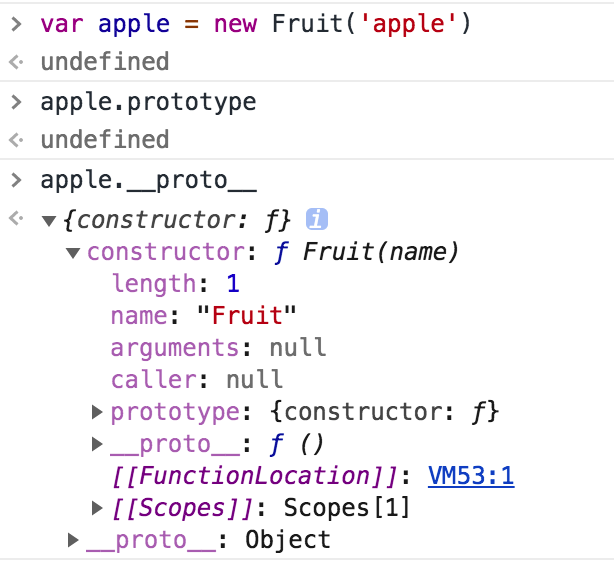
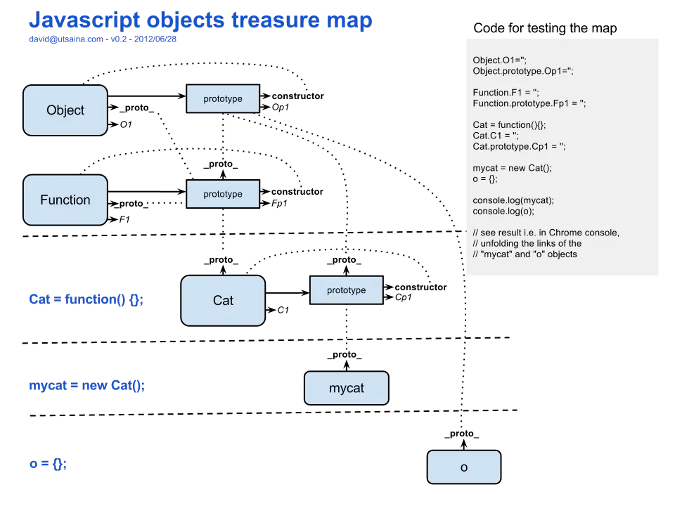

# JavaScript是如何设计面向对象的？

## 原型和原型链

1.理解原型设计模式以及JavaScript中的原型规则  
2.instanceof的底层实现原理，手动实现一个instanceof  
4.实现继承的几种方式以及他们的优缺点  
5.至少说出一种开源项目(如Node)中应用原型继承的案例  
6.可以描述new一个对象的详细过程，手动实现一个new操作符  
7.理解es6 class构造以及继承的底层实现原理 


虽然这些Javascript机制和传统的面向对象语言中的“类初始化”和“类继承”很相似，但是Javascript中的机制有一个核心的区别，那就是不会进行复制，对象之间是通过内部的[[Prototype]]链关联的。--《你不知道的javascript》

每个对象都有一个原型对象， 通过_proto_指针指向上一个原型，并从中继承方法和属性，同时原型对象也都有原型对象，这个一层一层，最终执行null,这就是原型链。
JavaScript是一种基于原型的语言，每个对象拥有一个原型对象，对象以其原型为模板，从原型继承方法和属性，这个属性和方法定义在对象的构造器函数（constructor）的prototype属性，而非对象实例本身。该书使用“Behavior Delegation”描述对象之间的关系。

原型链： 如果一个对象没有找到需要的属性和方法，引擎就会在对象的[[Prototype]]关联的对象上查找，如果后者没有，就是继续向上查找，这一系列对象的链接称为“原型链”。


## new命令原理

> 四步操作
- 创建一个空对象，作为将要返回的对象实例。
- 将这个空对象的原型，指向构造函数的prototype属性。
- 函数内部的this关键字指向这个空对象。
- 开始执行构造函数内部的代码。

```
function Car(){
    this.price = 1000
}
var nCar = new Car();

```
1. new指令用途
使用new指令时，构造函数内部，this指的是一个新生成的空对象，所有针对this的操作，都会发生在这个空对象上。构造函数之所以叫“构造函数”，就是说这个函数的目的，就是操作一个空对象（即this对象），将其“构造”为需要的样子。
如果构造函数内部有return语句，而且return后面跟着一个对象，new命令会返回return语句指定的对象；否则，就会不管return语句，返回this对象。

```js
function _new(/* 构造函数 */ constructor, /* 构造函数参数 */ params) {
    // 将 arguments 对象转为数组
    var args = [].slice.call(arguments);
    // 取出构造函数
    var constructor = args.shift();
    // 创建一个空对象，继承构造函数的 prototype 属性
    var context = Object.create(constructor.prototype);
    // 执行构造函数
    var result = constructor.apply(context, args);
    // 如果返回结果是对象，就直接返回，否则返回 context 对象
    return (typeof result === 'object' && result != null) ? result : context;
  }
  
  // 实现2
  function realizeNew(){
      // 创建一个新对象
      var obj = {};
      // 获取构造函数
      var Con = [].shift.call(arguments);
      // 将新生对象的原型指向构造函数的原型
      obj.__proto__ = Con.prototype;
      // 将this绑定绑定为当前对象
      let result = Con.apply(obj, arguments);
      // 返回new出来的对象
      return typeof result === "object" ? result : obj
  
  }
  
  function Person (name,age){
      this.name = name;
      this.age = age;
      this.say = function () {
          console.log("I am " + this.name)
      }
  }
   
  //通过new创建构造实例
  // 实例
  var actor1 = _new(Person, '张三', 28);
  var actor2 = realizeNew(Person, '张思', 18)
  console.log(actor1)
  console.log(actor2)
  console.log(actor1.__proto__ === actor2.__proto__); // true
```

#### __proto__和prototype和constructor

##### 概念
- prototype 是函数(function) 的一个属性方法, 它指向函数的原型.
- __proto__ 是对象的内部属性, 它指向构造器的原型, 对象依赖它进行原型链查询，instanceof 也是依赖它来判断是否继承关系.
由上, prototype 只有函数才有, 其他(非函数)对象不具有该属性. 而 __proto__ 是对象的内部属性, 任何对象都拥有该属性.

```
function Fruit(name){
    this.name = name;
}
var apple = new Fruit('apple')

console.log(Fruit.prototype); // 
console.log(apple.__proto__ == Fruit.prototype);//true
```
  

```js
var obj = {name: 'jack'},
    arr = [1,2,3],
    reg = /hello/g,
    date = new Date(),
    err = new Error('exception');
console.log(obj.__proto__  === Object.prototype); // true  
console.log(arr.__proto__  === Array.prototype);  // true  
console.log(reg.__proto__  === RegExp.prototype); // true  
console.log(date.__proto__ === Date.prototype);   // true  
console.log(err.__proto__  === Error.prototype);  // true  
```

##### __proto
 所有的构造器都继承于Function.prototype,有构造器都继承了Function.prototype的属性及方法。如length、call、apply、bind（ES5）等.
 Math，JSON是以对象形式存在的，无需new。由于任何对象都拥有 __proto__ 属性指向构造器的原型. 即它们的 __proto__ 指向Object对象的原型(Object.prototype)。
```
console.log(Fruit.__proto__ === Function.prototype);//true
console.log(Number.__proto__   === Function.prototype); // true
console.log(Boolean.__proto__  === Function.prototype); // true
console.log(String.__proto__   === Function.prototype); // true
console.log(Object.__proto__   === Function.prototype); // true
console.log(Function.__proto__ === Function.prototype); // true
console.log(Array.__proto__    === Function.prototype); // true
console.log(RegExp.__proto__   === Function.prototype); // true
console.log(Error.__proto__    === Function.prototype); // true
console.log(Date.__proto__     === Function.prototype); // true

// 对象__proto属性
console.log(Math.__proto__ === Object.prototype);  // true
console.log(JSON.__proto__ === Object.prototype);  // true
```
  


参考： 
[从prototype与__proto__窥探JS继承之源](https://juejin.im/post/58f9d0290ce46300611ada65)

#### [Object.create](https://developer.mozilla.org/en-US/docs/Web/JavaScript/Reference/Global_Objects/Object/create)
The Object.create() method creates a new object, using an existing object as the prototype of the newly created object.
Object.create方式创建一个新的对象，使用原有的对象作为原型。
```js
const person = {
  isHuman: false,
  printIntroduction: function () {
    console.log(`My name is ${this.name}. Am I human? ${this.isHuman}`);
  }
};

const me = Object.create(person);
me.name = "Matthew"; // "name" is a property set on "me", but not on "person"
me.isHuman = true; // inherited properties can be overwritten
me.printIntroduction();
// expected output: "My name is Matthew. Am I human? true"
```

#### new.target
如果函数是由new调用，那么在构造函数内部new.target就表示这个函数。因此可以使用new.target判定函数是不是由new进行实例。
```js
function f(){
    console.log(new.target === f);
    if (!new.target) {
    throw new Error('请使用 new 命令调用！');
  }
}
f(); // false
new f(); // true
```

## 继承

许多OO语言都支持两种继承方式: 接口继承和实现继承。接口继承只继承方法签名,而实现继承则继承实际的方法.由于js中方法没有签名,在ECMAScript中无法实现接口继承ECMAScript只支持实现继承,而且其实现继承主要是依靠原型链来实现的.


每个构造函数(constructor)都有一个原型对象(prototype),原型对象都包含一个指向构造函数的指针,而实例(instance)都包含一个指向原型对象的内部指针。
如果试图引用对象(实例instance)的某个属性,会首先在对象内部寻找该属性,直至找不到,然后才在该对象的原型(instance.prototype)里去找这个属性.


