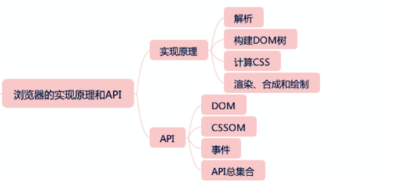

# markdown用例

## 文字
### 标题
```
# 这是一级标题
## 这是二级标题
### 这是三级标题
#### 这是四级标题
##### 这是五级标题
###### 这是六级标题
```
# 这是一级标题
## 这是二级标题
### 这是三级标题
#### 这是四级标题
##### 这是五级标题
###### 这是六级标题


### 样式
```
**这是加粗的文字**  
*这是倾斜的文字*
***这是斜体加粗的文字***  
~~这是加删除线的文字~~
```
**这是加粗的文字**  
*这是倾斜的文字*
***这是斜体加粗的文字***  
~~这是加删除线的文字~~


## 图片

```markdown
  


```


## 表格

```
表头|表头|表头
---|:--:|---:
内容|内容|内容
内容|内容|内容

第二行分割表头和内容。
- 有一个就行，为了对齐，多加了几个
文字默认居左
-两边加：表示文字居中
-右边加：表示文字居右
注：原生的语法两边都要用 | 包起来。此处省略
```
表头|表头|表头
---|:--:|---:
内容|内容|内容
内容|内容|内容

第二行分割表头和内容。
- 有一个就行，为了对齐，多加了几个
文字默认居左
-两边加：表示文字居中
-右边加：表示文字居右
注：原生的语法两边都要用 | 包起来。此处省略


## 样式
********
- 提示
```
:::tip  
创建实线
:::
```
:::tip  
创建实线
:::

- 横线
```
*******
-------
+++++++
```
-----

- 链接
```
 [链接](https://www.npmjs.com/signup)
```
 [链接](https://www.npmjs.com/signup)

- 代码段
```js
console.log()
```

- 引用
```
> 引用
>> 引用中的引用
```

- 角标（vuepress）
```
#### Vue <Badge text="2.5.0+"/> 
#### Vue <Badge text="beta" type="warn" vertical="top"/> 
#### Vue <Badge text="废弃" vertical="middle" type="error"/>
```
#### Vue <Badge text="2.5.0+"/> 
#### Vue <Badge text="beta" type="warn" vertical="top"/> 
#### Vue <Badge text="废弃" vertical="middle" type="error"/>

- 参考资料

_____

参考资料：
1. [webpack中文网](https://www.webpackjs.com/guides/)