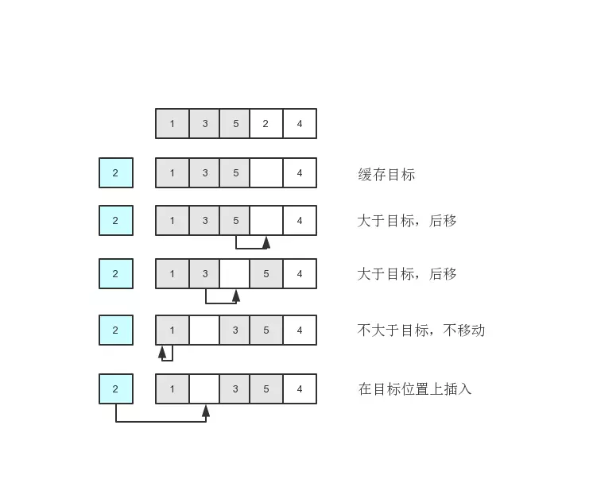

# 数据结构算法

## 算法复杂度


### 递归算法问题

1. 爬楼梯，楼梯共有n阶，每次可以爬1阶或者2阶，请问工作多少种爬法？

思路： 
- 假设只有1级，f(1) = 1, 只有1种爬法
- 假设有2级，那有法f（2）= 2, 有2种爬法
- 假设有3级，那么第1步可以有2种爬法：
- -  第一步1级，剩下n-1级就有f(n-1)种爬法
- -  第一步2级，剩下n-2级就有f(n-2)种爬法
- -  那么就是f(3) = f(2) + f(1)
```js
function f(n){
    if(n=== 1) return 1;
    if(n=== 2) return 2;
    return f(n-1) + f(n-2)
}
```

> 通过缓存计算结果进行优化

```js
let cacheRet = {};
function f(n){
    if(n=== 1) return 1;
    if(n=== 2) return 2;
    if(cacheRet[n]){
        return cacheRet[n];
    }
    let ret = f(n-1) + f(n-2);
    cacheRet[n] = ret;
}
```

> 使用迭代方法计算
```js
function f(n){
    if(n=== 1) return 1;
    if(n=== 2) return 2;
    let pre = 2;
    let prepre = 1;
    let ret = 0;
    for(let i = 3; i <= n; i++){
        ret = pre + prepre
        prepre = pre;
        pre = ret;
    }
    return ret;
}
```
### 总结：

 - 一个问题只要同时满足以下3个条件，就可以用递归来解决：
1.问题的解可以分解为几个子问题的解。何为子问题？就是数据规模更小的问题。
2.问题与子问题，除了数据规模不同，求解思路完全一样
3.存在递归终止条件

- 迭代与递归
因为递归本身就是借助栈来实现的，只不过我们使用的栈是系统或者虚拟机本身提供的，我们没有感知罢了。如果我们自己在内存堆上实现栈，手动模拟入栈、出栈过程，这样任何递归代码都可以改写成看上去不是递归代码的样子。


### 排序算法

以扑克牌排序为例子：

1. 冒泡排序
一副牌上手，从左到右开始排序，从小到大，
- 开始比较第一张牌和第二张牌，第一张牌比第二张牌大，交换位置
- 比较第二张牌和第三张牌
```js
function bubbleSort(arr){
    for (let i = 0; i < arr.length; i++) {
        for (let j = i + 1; j < arr.length; j++) {
            if(arr[i] > arr[j]){
                let tmp = arr[i];
                arr[i] = arr[j];
                arr[j] = tmp;
            }
        }   
    }
    return arr;
}
let  bArray = [12, 22, 2,4, 6, 1,45, 56];
```

2. 插入排序
将数组分为有序区和无序区。插入算法的核心思想是取未排序区间中的元素，在已排序区间中找到合适的插入位置将其插入，并保证已排序区间数据一直有序。重复这个过程，直到未排序区间中元素为空，算法结束。可以想象成班级同学高矮排队。
问题归结到如何将一个元素插入到有序到数组里。
- 以第一张牌为基准，分别将第二张牌跟第一张牌排一起
- 第三张牌和前面两张排序

  

```js
// 从小到大, 跟第一个元素比较，如果比较小就交换位置，否则跟第二个元素比较，一旦交换，需要改变原来有序数组后面到索引
function insertSort(array) {
    let j;
    for (let i = 1; i < array.length; i++) {
        j = i;
        tmp = array[i];
        // 比较当前值和一排序数组到每个元素，寻找arr[i]需要到的位置。
        while (j > 0 && array[j - 1] > tmp) { // 
            array[j] = array[j - 1];
            j--;
        }
        array[j] = tmp;
    }
    return array;
}
```
按照从小到大排序：
取出a[i]元素时，拿去跟有序区的每个元素比较，如果小于前一个元素，那可能前前面还是更小的元素，那需要腾出位置，直到找到这个位置。
  


### 选择排序
1. 如何寻找最小值
```js
let array = [6, 2, 4, 5, 3]
let minIndex = 0
for (let i = 0; i < array.length; i++) {
  if (array[minIndex] > array[i]) {
    minIndex = i
  }
}
console.log(minIndex) // 1
```
  

```js
function selectionSort(arr){
    for(let i=0; i< arr.length-1; i++){
        let sIndex = i;
        let j = i+1;
        for(j; j< arr.length; j++){
            if(arr[sIndex] > arr[j]){
                sIndex = j;
            }
        }
        if(sIndex !== i){
            let tmp = arr[sIndex];
            arr[sIndex] = arr[i];
            arr[i] = tmp;
        }
    }
    return arr;
}
```