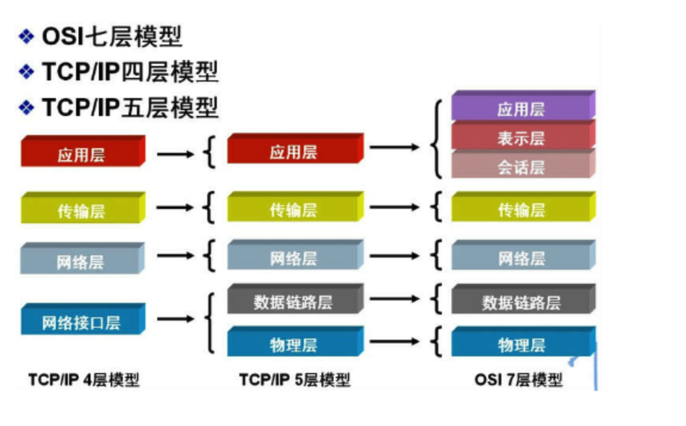
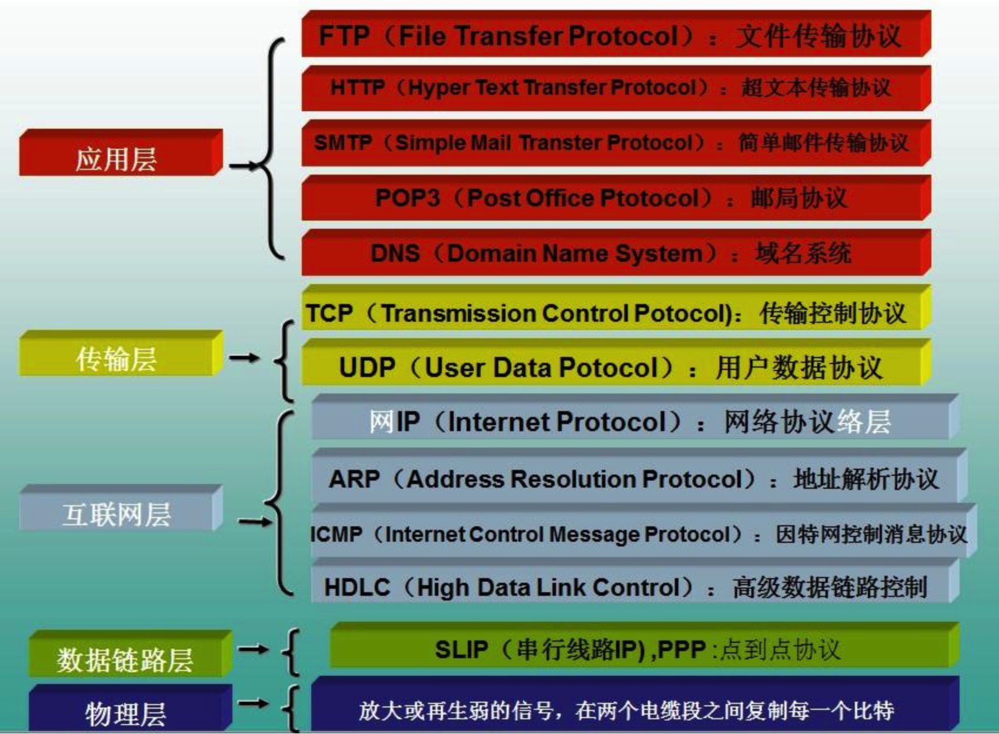

# http协议

1. HTTP有哪些方法？
2. http的请求报文和响应是什么样的？
3. HTTP的部首有哪些
4. HTTP的状态码
5. HTTPS是如何保证安全的？https 的握手过程
6. 什么是CA证书？整个网站进行验证的流程是什么？
7. http各个版本的区别是什么？解决了哪些问题？
8. tcp/ip协议的三次握手，四次挥手
9. 缓存策略
10. tcp/UDP区别， websocket,ftp协议
11. 计算机网络的7层结构？每一层做了什么事情？

## 七层网络协议和各个协议层的用途
> 协议的分层

两者区别应用层的拆分：在应用层多拆分出应用层、表示层、会话层

OSI层|功能|设备|协议
---|:--:|---:|---:
应用层|用户接口、应用程序（文件电邮服务）|网关|TFTP、HTTP、DNS、Telnet、SMTP
表示层|数据的表示、压缩和加密|网关|无协议
会话层|会话的建立和借宿|网关|无协议
传输层|提供端对端的接口|网关|TCP, UDP
网络层|为数据包选择路由、寻址|网关|IP、ICMP、RIP、
数据链路层|保证无差错的数据链路、传输有地址的帧以及错误检测功能|交换机、网桥、网卡|SLIP,CSLIP
物理层|将信息编码成电流脉冲或其它信号用于网上传输|集线器、中继器|IOS2110

## IP/UDP/TCP

- 1. IP网际协议（Internet Protocol，简称 IP）标准：把数据包送达目的主机,计算机的地址就称为 IP 地址，访问任何网站实际上只是你的计算机向另外一台计算机请求信息。IP是网络层协议，属于比较底层的协议。

以一个数据包的传输流程为例， IP协议只解决的一个数据包从一台计算机传输到另一台计算机的问题， 但是，传到另一台计算机的什么程序，并没有解决。所以还有TCP/UDP协议解决这个问题。

- 2. UDP（User DateGram Protocal）：把数据包送达应用程序, UDP 通过端口号把数据包分发给正确的程序。
UDP数据包传输速率非常快，但是不能保证数据的完整性，数据丢包也没有重发机制，要对数据完整性的要求不是很高的业务场景上，比如直播视频、互动游戏

- 3. TCP（Transmission Control Protocal）传输控制协议，是一种面向连接、可靠、基于字节流的传输协议。相对于UDP有两个优点：
 - -  数据包丢失重传机制
 - -  数据包排序机制
TCP为了实现数据传输的可靠性，TCP传输建立连接需要“三次握手”， 在数据传输过程中

## http版本发展史：

版本路线如下：
HTTP/0.9： 协议诞生自 1989 年，第一版本是 HTTP 0.9，但 HTTP 0.9 并不是一个正式标准。
HTTP/1.0： 1996 年，根据 RFC 1945，HTTP 1.0 成为 IEFT 标准，
HTTP/1.1： 1999 年，在 RFC 2616 中发布了 HTTP 1.1。
HTTP/2：   HTTP 2.0 于 2015 年发布

### HTTP 1.0 时代最重要的两个大问题：
1. TCP 连接无法复用，每次请求都需要重新建立 TCP 通道，也就要重复三次握手和四次挥手的情况；就是说每个 TCP 连接只能发送一个请求。
2. 队头阻塞，每个请求都要过“独木桥”，桥宽为一个请求的宽度；也就是说，即使多个请求并行发出，也只能一个接一个地进行请求排队。

### HTTP 1.1 的改进点
1. 长连接：HTTP 1.1 支持长连接（Persistent Connection），且默认就开启了 Connection：keep-alive，这样在一个 TCP 连接上可以传送多个 HTTP 请求和响应，减少了建立和关闭连接的消耗和延迟。

2. 管线化（Http Pipelining）: 使得多个请求使用同一个 tcp 连接使请求并按照并行方式成为可能：多个请求同时发起，无需等待上一个请求的回包。但是需要注意，管线化只是让请求并行，但并没有从根本上解决队头阻塞问题，因为响应仍然要遵循先进先出的原则，第一个请求的回包发出之后，才会响应第二个请求。同时，浏览器供应商很难实现管道，而且大多数浏览器默认禁用该特性，有的甚至完全删除了它。

### HTTP 1.1 的不足
- 队头堵塞问题没有真正解决
- 明文传输，安全性有隐患
- header 携带内容过多，增加了传输成本
- 默认开启 keep-alive 可能会给服务端造成更大的性能压力，比如对于一次性的请求（图片 CDN 服务），在文件被请求之后还保持了不必要的连接很长时间

### HTTP/2的特性

1. http2相关概念
帧：HTTP 2.0 中，客户端与服务器通过交换帧来通信，帧是基于这个新协议通信的最小单位。
消息：是指逻辑上的 HTTP 消息，比如请求、响应等，由一或多个帧组成。
流：流是连接中的一个虚拟信道，可以承载双向的消息；每个流都有一个唯一的标识符

## 图解http

HTTP+ 加密 + 认证 + 完整性保护 =HTTPS

http通信部分接口使用SSL(Secure Socket Layer)或TLS（transport layer security）

### 加密形式
 - 1. 对称加密 common key crypto system,加密和解密使用相同的密钥
 - 2. 非对称加密, 加密和解密使用不同都密钥

 