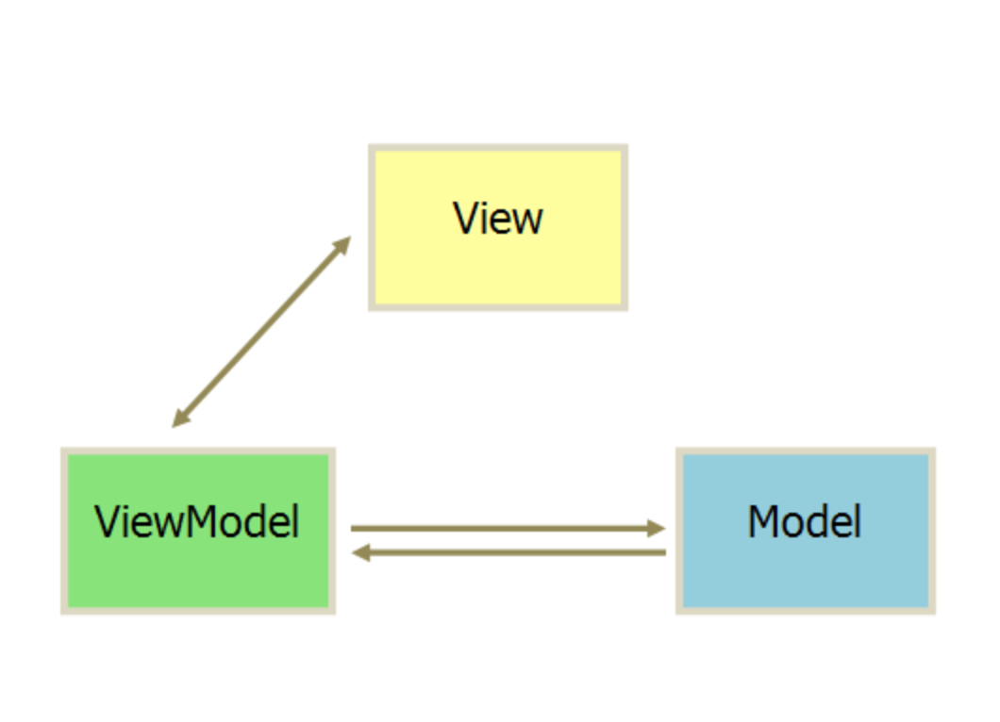

## MVVM


- 视图（View）：用户界面。View层组件有一定处理输入输出并作出反馈对能力 
- 模型（Model）：数据保存。就是业务逻辑相关的数据对象，通常从数据库映射而来，我们可以说是与数据库对应的model

- ViewModel：就是与界面(view)对应的Model。因为，数据库结构往往是不能直接跟界面控件一一对应上的，所以，需要再定义一个数据对象专门对应view上的控件。而ViewModel的职责就是把model对象封装成可以显示和接受输入的界面数据对象。  
ViewModel就是View与Model的连接器，View与Model通过ViewModel实现双向绑定。 


常见实现数据绑定的几种做法：

- 1. 发布订阅模式(backbone.js)
- 2. 脏值检查(angular)
- 3. 数据劫持（vue）

vue.js 则是采用数据劫持结合发布者-订阅者模式的方式，通过Object.defineProperty()来劫持各个属性的setter，getter，在数据变动时发布消息给订阅者，触发相应的监听回调。


> MVVM实现步骤
1. observer监听器，做两个事情，一是将数据对象改造成响应式数据，二是做个订阅器，数据的修改能够通知到订阅者
2. compile编译器， 对模板进行解析，对模板绑定对数据和事件进行解析
3. Watcher, 连接compile和observe, 能够订阅并收到每个属性变动对通知，执行指令绑定对相应
4. 实现一个Watcher，作为连接Observer和Compile的桥梁，能够订阅并收到每个属性变动的通知，执行指令绑定的相应回调函数，从而更新视图
5. mvvm入口函数，整合以上三者

## 1. 将一个对象改为响应式数据（使用数据劫持方法）
```js
var data = { name: 'Jack Ma', lang: ['go', 'php'] , location: {city: '深圳', province: 'GD'}}
observe(data)
let name = data.name // -> get value
data.name = 'Tony Ma' // -> change value

function observe(obj) {
// 判断类型
  if (!obj || typeof obj !== 'object') {
    return
  }
  Object.keys(obj).forEach(key => {
    defineReactive(obj, key, obj[key])
  })
}

function defineReactive(obj, key, val){
    observe(val)
    Object.defineProperty(obj, key,{
        configurable: true, // 决定是否可以delete key
        enumerable: true,
        get: function() {
            console.log('get value')
            return val;

        },
        set: function(newVal){
            console.log('set value')
            val = newVal
        }
    })
}
```
## 2. 实现一个消息订阅器
```

```


