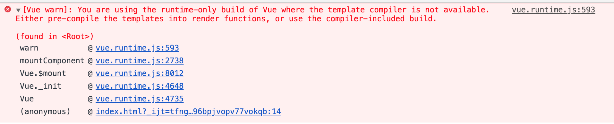

# VUE源码学习

## 第一章 源码目录设计和构建方式

1. 不同编译版本差距

先看个错误
```js
  var app = new Vue({
        el: '#app',
        template: `<div id="test"></div>`,
        data: {
            message: 'Hello Vue!'
        }
    })
```
npm包中vue/dist目录下，打包出来很多版本
| | UMD | CommonJS | ES Module |
| --- | --- | --- | --- |
| **Full** | vue.js | vue.common.js | vue.esm.js |
| **Runtime-only** | vue.runtime.js | vue.runtime.common.js | vue.runtime.esm.js |
| **Full (production)** | vue.min.js | | |
| **Runtime-only (production)** | vue.runtime.min.js | | |

区别：
- 1. runtime-only版本和full版本的区别
**Vue完整版**指的是同时包含编译器和运行时版本。
**vue编译器**将模板字符串编译成javascript渲染函数（render函数）的代码。
**运行时**用来创建 Vue 实例、渲染并处理虚拟 DOM 等的代码。基本上就是除去编译器的其它一切。

- 2. UMD VS CommonJs VS ESModule
UMD可以使用script标签直接引用,融合和CommonJs和ESModule
CommonJs规范模块加载是同步的，这就意味着，只有加载完成，后面的代码才能执行。CommonJS 版本用来配合老的打包工具使用
ESModule版本，ESM格式的js可以做静态化分析，打包工具利用这一点进行tree-shaking,将不用的代码移除。


## 第二章 数据驱动原理
1. 数据驱动是vue的核心思想之一，视图修改是有数据驱动，相对于jquery形式的开发，vue下的开发，使用数据驱动，通过修改数据，
在框架底层在做dom结构修改
```js
<div id="app">
  {{ message }}
</div>
var app = new Vue({
  el: '#app',
  data: {
    message: 'Hello Vue!'
  }
})
```


2. new Vue到底发生了什么？

2.1 先看vue函数的定义。new Vue()执行Vue原型上的_init方法
```js
function Vue (options) {
  if (process.env.NODE_ENV !== 'production' &&
    !(this instanceof Vue)
  ) {
    warn('Vue is a constructor and should be called with the `new` keyword');
  }
  this._init(options);
}
```
2.2 再看Vue原型的_init
```js
function initMixin (Vue) {
  Vue.prototype._init = function (options) {
    var vm = this;
    // a uid
    vm._uid = uid$3++;

    // 调试用，检查代码运行状态，先忽略
    var startTag, endTag;
    /* istanbul ignore if */
    if (process.env.NODE_ENV !== 'production' && config.performance && mark) {
      startTag = "vue-perf-start:" + (vm._uid);
      endTag = "vue-perf-end:" + (vm._uid);
      mark(startTag);
    }

    // a flag to avoid this being observed
    vm._isVue = true;
    // merge options
    if (options && options._isComponent) { // 是组件
      // optimize internal component instantiation
      // since dynamic options merging is pretty slow, and none of the
      // internal component options needs special treatment.
      initInternalComponent(vm, options);
    } else { // 非组件
      vm.$options = mergeOptions(
        resolveConstructorOptions(vm.constructor),
        options || {},
        vm
      );
    }
    /* istanbul ignore else */
    if (process.env.NODE_ENV !== 'production') {
      initProxy(vm);
    } else {
      vm._renderProxy = vm;
    }
    // expose real self
    vm._self = vm;
    // 初始化生命周期
    initLifecycle(vm);
    // 初始化事件？
    initEvents(vm);
    // 初始化render方法
    initRender(vm);
    // 执行回调钩子
    callHook(vm, 'beforeCreate');
    // 执行inject
    initInjections(vm); // resolve injections before data/props
    // 初始化data
    initState(vm);
    // 执行provide
    initProvide(vm); // resolve provide after data/props
    // 执行回调created钩子
    callHook(vm, 'created');

    /* istanbul ignore if */
    if (process.env.NODE_ENV !== 'production' && config.performance && mark) {
      vm._name = formatComponentName(vm, false);
      mark(endTag);
      measure(("vue " + (vm._name) + " init"), startTag, endTag);
    }
    // 挂载实例
    if (vm.$options.el) {
      vm.$mount(vm.$options.el);
    }
  };
}

总结一下Vue初始化做的哪些事情：
- 合并配置
- 初始化生命周期
- 初始化事件中心
- 初始化渲染
- 初始化data、props、computed、watcher    

```


## 第三章 


参考：

1.《vue源码解析》
2. [逐行剖析 Vue.js 源码](https://nlrx-wjc.github.io/Learn-Vue-Source-Code/)  
3. [剖析Vue原理&实现双向绑定MVVM](https://segmentfault.com/a/1190000006599500)