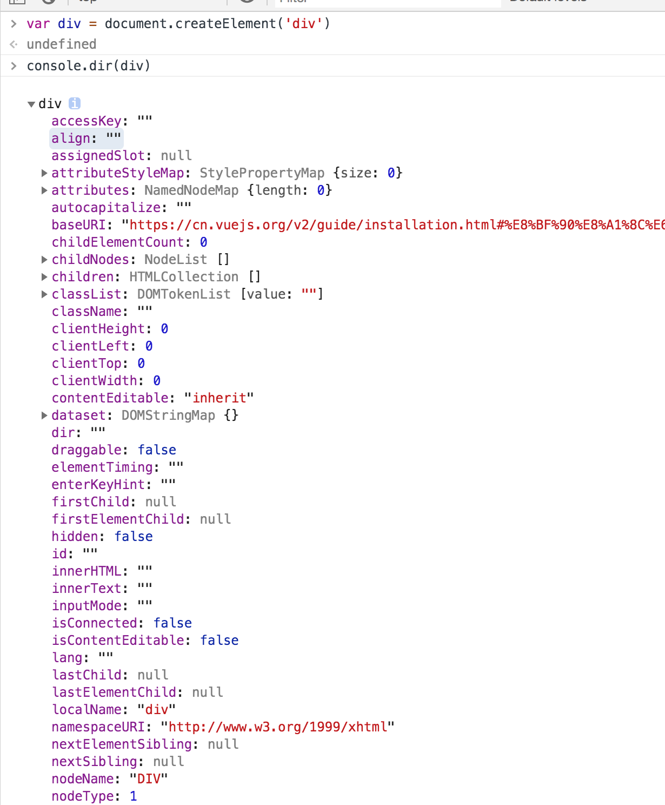

## 3.Virtual DOM

### 3.1 Virtual Dom原理
创建一个元素div，并打印其dom结构，可以看出Dom设计的非常复杂。当我们频繁去操作dom元素，会产生一定的性能问题。操作dom结构，会产生什么影响？浏览器重排,重绘？dom结构比较大？




Virtual DOM 的目的并非只是速度，其核心价值在于用 JavaScript 表达 DOM 状态，因此它本身其实是有成本的。即每次更新时， vdom 树需要每次都重新建立，因此传统的 vdom 是有性能瓶颈。

```js
// VNode源码
/* @flow */

export default class VNode {
  tag: string | void;
  data: VNodeData | void;
  children: ?Array<VNode>;
  text: string | void;
  elm: Node | void;
  ns: string | void;
  context: Component | void; // rendered in this component's scope
  key: string | number | void;
  componentOptions: VNodeComponentOptions | void;
  componentInstance: Component | void; // component instance
  parent: VNode | void; // component placeholder node

  // strictly internal
  raw: boolean; // contains raw HTML? (server only)
  isStatic: boolean; // hoisted static node
  isRootInsert: boolean; // necessary for enter transition check
  isComment: boolean; // empty comment placeholder?
  isCloned: boolean; // is a cloned node?
  isOnce: boolean; // is a v-once node?
  asyncFactory: Function | void; // async component factory function
  asyncMeta: Object | void;
  isAsyncPlaceholder: boolean;
  ssrContext: Object | void;
  fnContext: Component | void; // real context vm for functional nodes
  fnOptions: ?ComponentOptions; // for SSR caching
  fnScopeId: ?string; // functional scope id support

  constructor (
    tag?: string,
    data?: VNodeData,
    children?: ?Array<VNode>,
    text?: string,
    elm?: Node,
    context?: Component,
    componentOptions?: VNodeComponentOptions,
    asyncFactory?: Function
  ) {
    this.tag = tag
    this.data = data
    this.children = children
    this.text = text
    this.elm = elm
    this.ns = undefined
    this.context = context
    this.fnContext = undefined
    this.fnOptions = undefined
    this.fnScopeId = undefined
    this.key = data && data.key
    this.componentOptions = componentOptions
    this.componentInstance = undefined
    this.parent = undefined
    this.raw = false
    this.isStatic = false
    this.isRootInsert = true
    this.isComment = false
    this.isCloned = false
    this.isOnce = false
    this.asyncFactory = asyncFactory
    this.asyncMeta = undefined
    this.isAsyncPlaceholder = false
  }

  // DEPRECATED: alias for componentInstance for backwards compat.
  /* istanbul ignore next */
  get child (): Component | void {
    return this.componentInstance
  }
}

export const createEmptyVNode = (text: string = '') => {
  const node = new VNode()
  node.text = text
  node.isComment = true
  return node
}

export function createTextVNode (val: string | number) {
  return new VNode(undefined, undefined, undefined, String(val))
}

// optimized shallow clone
// used for static nodes and slot nodes because they may be reused across
// multiple renders, cloning them avoids errors when DOM manipulations rely
// on their elm reference.
export function cloneVNode (vnode: VNode): VNode {
  const cloned = new VNode(
    vnode.tag,
    vnode.data,
    vnode.children,
    vnode.text,
    vnode.elm,
    vnode.context,
    vnode.componentOptions,
    vnode.asyncFactory
  )
  cloned.ns = vnode.ns
  cloned.isStatic = vnode.isStatic
  cloned.key = vnode.key
  cloned.isComment = vnode.isComment
  cloned.fnContext = vnode.fnContext
  cloned.fnOptions = vnode.fnOptions
  cloned.fnScopeId = vnode.fnScopeId
  cloned.asyncMeta = vnode.asyncMeta
  cloned.isCloned = true
  return cloned
}

```

### 3.2 Dom diff实现方法
### 3.3 Vue3.0 Dom Diff改进
