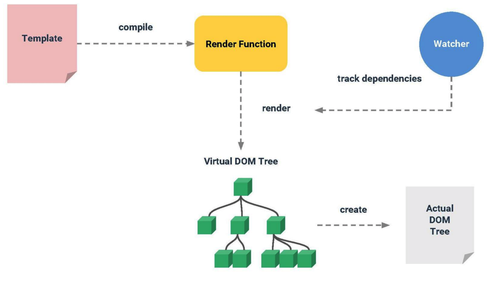
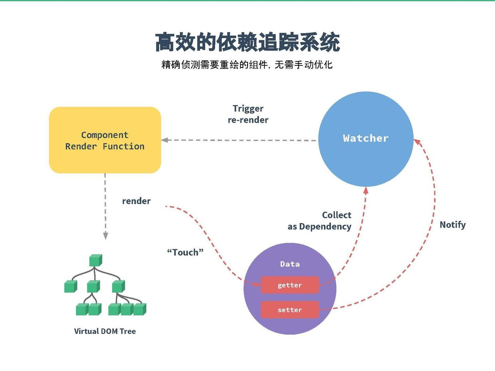
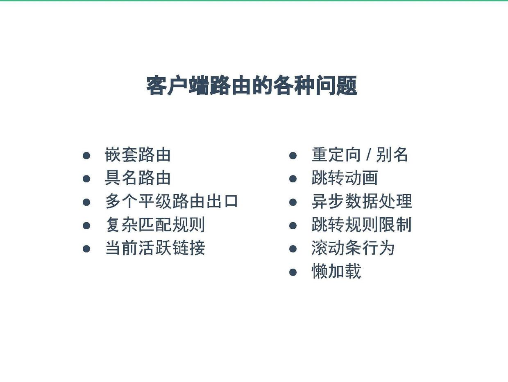
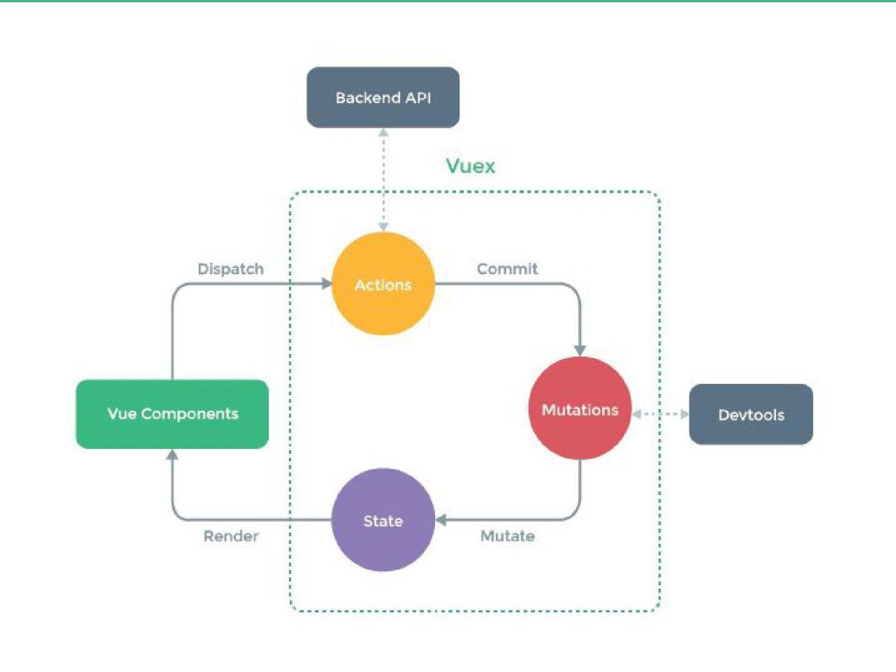

# VUE杂谈

### [尤雨溪：Vue 2.0，渐进式前端解决方案](https://www.infoq.cn/article/vue-2-progressive-front-end-solution)
文章的内容是尤雨溪2016年Qcon的演讲

## 1. 为什么需要框架？

- 解决复杂问题
- 框架（工具）复杂度与问题复杂度的权衡

## 2. 框架复杂度

- 声明式渲染
- 组件系统
- 客户端路由
- 状态管理
- 构建工具

## 3. 如何理解vue文档的渐进式框架
- 核心 + 生态栈
- 可弹性的工具复杂度应对不同复杂度场景（视图层核心+工具库）

## 4. vue设计

### 4.1 声明式渲染：
大部分框架都认为：DOM尽可能是一个函数式到状态的映射。DOM的状态就是数据的状态的一种映射。
所以逻辑尽可能在状态层面进行，View应该在框架的帮助下更新到合理的状态。

- Vue的渲染流程

a. vue编译器会把模板编译成渲染函数
b. 渲染函数被调用会返回一个虚拟dom树，这个dom树就是描述当前应用的状态
c. dom diff
d. 虚拟dom树交个dispath函数，把虚拟dom树施加到真实dom上

- 使用vitural dom 的原因：
a. 浏览器的js引擎非常快
b. dom的渲染非常慢

- vue使用template与渲染函数/jsx：
a. 模板的语法接近html, 语义化、css编写方便
b. 渲染函数、jsx更为灵活，便于处理复杂逻辑

- Vue依赖检测追踪系统的设计与实现

### 4.2 组件系统
 - 组件的设计思想是，将UI结构映射到恰当的组件树
 - 组件通信方式，单向数据流，父组件通过props传递信息给子组件，子组件想要在父组件产生副作用，必须要派发事件。
 - vue的单文件组件设计是基于构建工具实现(vue-loader?),通过构建工具，可以对单文件（html、image、css）使用不同的处理器

### 4.3 客户端路由
页面应用的每个状态都会对应一个url，URL和组件树之间有个状态映射关系。客户端路由所做的工作就是生命式的将路由和组件状态对应起来。
使用hash去模拟一下，可以做出简单路由。

客户端路由需要解决很多问题：

### 4.4 状态管理
每个组件有自己的状态，也存再组件公用的状态。使用全局Store对象存储用户状态。
vuex有其使用规则，mutation显示触发store修改，action处理异步请求和其他副作用。

### 4.5 工具构建
